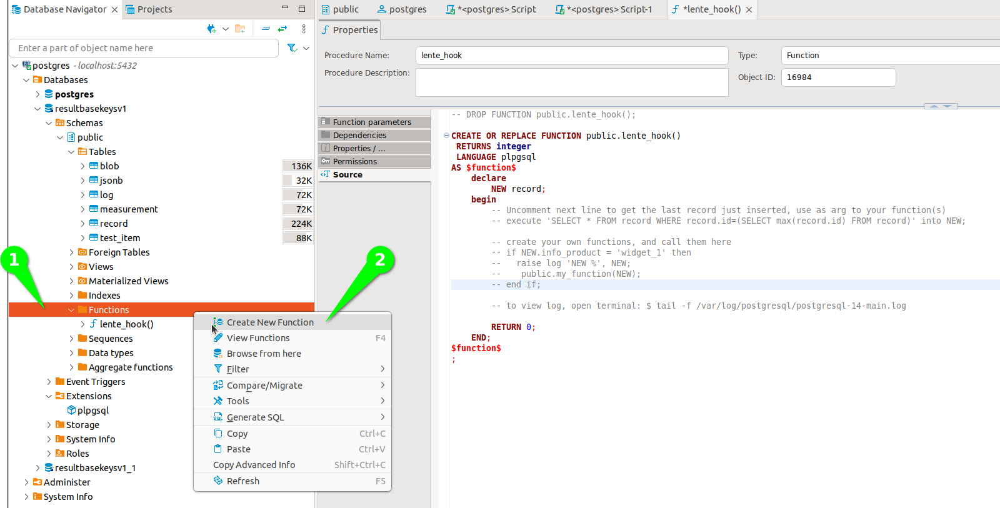
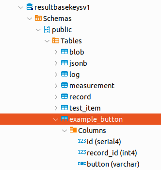

Results Database
################

All things databse related.

.. contents::
   :local:

Database Schema
***************

This diagram shows the dB schema and relationships,

.. image:: static/db_schema_01.png

All of the tables are connected together thru the (foriegn key) `record_id`.

record
======
This represents the instance of a test that ran.  Its a top level record that captures
all the conditions of the test when it ran.

The `info_*` section are fields that are set via the Prism Configuration and are related
to the the `info` section of the script.

The `key#` items are indexed keys that your script can set via `add_key()` api.  These keys should be used
as high level identifiers for making SQL queries.  For example, a product serial number
should probably be a key so that you can find the test record for a product serial number.
Typically these `key#` fields are not known until the test is run and retrieves the information.
For example, a key might be a microcontroller UID (MAC address) which is read at test time.

test_item
=========
For each test `record` there will multiple `test_items` as directed by the script.

Note that the name of the test item should be treated like a serial number and should be "formatted".
See naming proposals.

measurement
===========
For each `test_item` there may be multiple `measurements`.  measurement has two foreign keys, `record`
and `test_item`.

Note that the name of the measurement should be treated like a serial number and should be "formatted".
See naming proposals.  Prism `measurement()` API enforces good naming.

blob
====
For each `test_item` there may be multiple JSON `blob`.  blob has two foreign keys, `record`
and `test_item`.

log
===
A large string that represents the `log_bullet()` messages that appear in the GUI.  This
represents what was shown to the operator during the test.

jsonb
=====
*NOTE this feature is experimental.*

A custom JSON object that will be stored as a `jsonb` object which Postgres treats special
(see Postgres documentation).

Using `jsonb` is provided to allow one to essentially create their own "tables" in JSON.

SQL Queries
***********

Lente provides only basic test result monitoring or "dashboarding".  Because all Prism results end up in
an SQL database, adding dashboarding relevant for your business is easy.  The difficult part is choosing
among the many 3rd party options.

There are two classes of tools, those for developing SQL scripts, exploring the database schema, and those for
creating dashboards.

An example of a dashboarding tool is,

* `Grafana <https://grafana.com/>`_

An example of an SQL Tool is,

* `dBeaver <https://dbeaver.io/>`_

Note that the Lente Details console page has an SQL window at the bottom which shows the SQL query that
Lente is using, and may provide a starting point for your own queries.

Stats For All Measurements
==========================

An SQL script that will list all the measurements for a given set of records that meet the filtering criteria,

::

    -- Measurement Stats for all test measurements
    select m.name,
           count(m.value) count_val,
           AVG(CAST(m.value as Float)) avg_val,
           stddev(CAST(m.value as Float)) std_val,
           min(CAST(m.value as Float)) min_val,
           max(CAST(m.value as Float)) max_val
    from measurement m join record on m.record_id = record.id
    where m.unit not in ('STR', 'Boolean', 'None')
           -- add/remove filters as required, see schema for fields
           AND record.info_product = 'myproduct'
           AND record.info_bom = 'mybom'
           AND record.info_lot = 'mylot'
           AND record.info_location = 'mylocation'
           AND record.meta_result = 'PASS'
           AND record.meta_script = 'public/prism/scripts/mystage/myname.scr'
           AND record.meta_start >= '2023-11-10'
           AND record.meta_start <= '2023-11-15'
           group by m.name
           order by m.name

Test Item Duration
==================

An SQL script that will list all the stats for Test Item durations (how long did the test take),

::

    -- Test Time for all test measurements
    select ti.name,
           count(ti._duration) count_val,
           AVG(CAST(ti._duration as Float)) avg_val,
           stddev(CAST(ti._duration as Float)) std_val,
           min(CAST(ti._duration as Float)) min_val,
           max(CAST(ti._duration as Float)) max_val
    from test_item ti join record on ti.record_id = record.id
    where record.info_product = 'myproduct'
           -- add/remove filters as required, see schema for fields
           AND record.info_bom = 'mybom'
           AND record.info_lot = 'mylot'
           AND record.info_location = 'mylocation'
           AND record.meta_result = 'PASS'
           AND record.meta_script = 'public/prism/scripts/mystage/myname.scr'
           AND record.meta_start >= '2023-11-10'
           AND record.meta_start <= '2023-11-15'
           and CAST(ti._duration as Float) > 0.2
           group by ti.name
           order by ti.name

Lente dB Hook
*************

See Postgres Documentation regarding Functions. PostgreSQL functions, also known as Stored Procedures,
allow you to carry out operations that would normally take several queries and round trips in a single
function within the database.

When each record is added to the dB, Lente will call Postgres dB Function,
`public.lente_hook()`.  The purpose of this function stub is to allow you to add your own functions to be
called when a new Result record is added to the dB.

::

    CREATE FUNCTION lente_hook()
        RETURNS int4
        LANGUAGE plpgsql
    AS $function$
        declare
            NEW record;
        begin
            -- Uncomment next line to get the last record just inserted, use as arg to your function(s)
            -- execute 'SELECT * FROM record WHERE record.id=(SELECT max(record.id) FROM record)' into NEW;

            -- create your own functions, and call them here
            -- if NEW.info_product = 'widget_1' then
            --    raise log 'NEW %', NEW;
            --    public.my_function(NEW);
            -- end if;

            -- to view log, open terminal: $ tail -f /var/log/postgresql/postgresql-14-main.log

            RETURN 0;
        END;
    $function$
    ;

Review the comments in the snippet, as well as how to add logging statements for debugging.  While
developing your script you may also want to review Lente's log as it will also show helpful information.

If `lente_hook()` returns a non-zero value, Lente will log error the value into its log.

Note `if NEW.info_product = 'widget_1' then`, this is an example of having your scripts called based on
the product.  You can add more qualifiers as desired based on `record` fields.  A common use is to only call the
Function if the result is a PASS (or FAIL).

Adding Your Own Function
========================

The first step is to add your own Function and test it.  Using dBeaver,

1. Open up the Functions tab.  Note that stub function `lente_hook()` should already be installed.
2. Right Click on Functions and Create New Function.

You will be asked to create a name, select a Language and return type.  The options used in the
image are typical.

1. dBeaver will create an empty Function for you, you will need to add `return 0`, and a logging statement is added just for testing.
2. You will need to add parameter for the last record inserted that `lente_hook()` will send.
3. Modify `lente_hook()` to call your new function.

Export Measurement Example
==========================

Here is an example function that exports a measurement into a new table only for records that PASS and are from product "widget_1".

First, create your new table. Your script could create the table if it doesn't exist.  Note the table has a reference
to the record id.  id/record_id are not required but are good practice.

The script that populates this new table,

::

    -- DROP FUNCTION public.test_example();

    CREATE OR REPLACE FUNCTION public.test_example(new record)
        RETURNS int4
        LANGUAGE plpgsql
    AS $function$
        declare
            meas_button VARCHAR(10);
        begin
            -- if the DUT result is a PASS
            if new.meta_result = 'PASS' then
                -- get button the user pressed
                meas_button := (select measurement.value from measurement
                                where new.id = measurement.record_id and
                                measurement.name = 'example.prod_v0.tst00xx.TST003_Buttons.button');
                raise log 'Button %', meas_button;

                -- export to my new table
                INSERT INTO example_button(id, record_id, button)
                VALUES(default, new.id, meas_button);

            end if;
            return 0;
        END;
    $function$
    ;

The `lente_hook()` that calls the above function,

::

    -- DROP FUNCTION public.lente_hook();

    CREATE OR REPLACE FUNCTION public.lente_hook()
     RETURNS integer
     LANGUAGE plpgsql
    AS $function$
        declare
            NEW record;
            rv integer;
        begin
            -- Uncomment next line to get the last record just inserted, use as arg to your function(s)
            execute 'SELECT * FROM record WHERE record.id=(SELECT max(record.id) FROM record)' into NEW;

            -- create your own functions, and call them here
            if NEW.info_product = 'widget_1' then
               raise log 'NEW %', NEW;
               rv := public.test_example(NEW);
            end if;

            -- to view log, open terminal: $ tail -f /var/log/postgresql/postgresql-14-main.log

            RETURN 0;
        END;
    $function$
    ;

