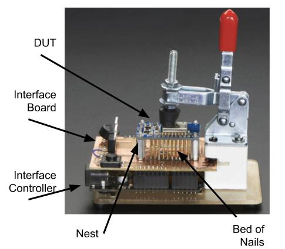

Test Jigs
#########

Test Jigs are used in production to test your product, which is referred to as Device Under Test (DUT).
These are custom designed fixtures that interface your product (DUT) to the Prism programs.

In general, it is your responsibility to develop your own test jigs based on your requirements.
Sistemi (in general) does not build jigs.  That being said, Sistemi has a reference platform that you may
be able to use, perhaps with some modifications.

.. contents::
   :local:

Definitions
===========

Interface Board
---------------

* A Printed Circuit Board (PCB) that has spring probes and some type of controller that
  the Prism can talk to, to take measurements, and otherwise control the stimulus to the DUT.
* Are custom developed depending on the DUT requirements

  * Sistemi has developed a reference design based on MicroPython board, see TBD

Interface Controller
--------------------

* A device with USB connectivity and a processor in which Prism can control and
  otherwise interface to
* Examples that could be used, Arduino, MicroPython, RaspBerry Pi, etc
* An ``Interface Controller`` may be designed into the ``Interface Board`` or
  it can be a daughter card that plugs into an ``Interface Board``

  * Sistemi has developed a reference design based on MicroPython board, see TBD

Bed of Nails
------------

* An arrangement of spring mounted probes that make electrical connection to the DUT
* the DUT has test points, which are large pads that the spring probes will make contact with

Nest
----

* A landing site for the DUT
* designed to make alignment between the Bed of Nails and the DUT test points

Considerations
==============

* Bed of Nails (probes) can wear out over time, you may want to consider a design that
  allows the Bed Of Nails to be replaced.  This ultimately depends on the cost of replacement.

Interface Board MicroPythonV1
==============================

NOTE: This is a work in progress and incomplete.

This is a reference design that you may or may not be able to use, depending on your DUT testing
requirements.  The intent here is to re-use this design to bootstrap your test jig design.

This design is open sourced on CircuitMaker tool.  This tool allows you to fork the design, make it your own.

The V1 design has a grid patter of probe points that **are NOT connected** to the controller, which is
a MicroPython v1.1 board.  The idea is that when you design your PCB, you place test points on the grid
pattern of the probe points without concern for the function (measurement or stimulous) type of the probe point.
**Although you must take care that all the functions you do need can be addressed by the MicroPython board.**

During the test jig development cycle you use the V1 board and manually wire connections from the probe
points to the function on the MicroPython board.  The V1 board design also includes a prototyping area so
that you could also manually assemble extra functions.

Finally once the development is done, you fork this V1 design and make the PCB connections.  You may also use
the V1 design in production if that works for you.

If the test point grid for V1 doesn't meet your needs, or the pin mux capability of the MicroPython board
doesn't have all the features you need, then you will have to design your own interface board.

MicroPython Pin Mux
-------------------

Full information is here https://docs.micropython.org/en/latest/pyboard/quickref.html

.. image:: _static/Screenshot_upybrd_01.png

Beyond the MicroPython functions, the Interface board has,

* Two Texas Instruments LP3886, linear step down adjustable DC/DC converters, 1 Amp, 0.8-4V
* One Texas Instruments INA220 current measurement IC (which can be connected to monitor current on any supply)

Probe Grid Pattern
------------------

Each gridline is 50mils.

.. image:: _static/micropythonboardV1_probe_grid.PNG

None of these probe points are wired to any function on the MicroPython Interface Board V1.  There are convenient
landing sites on the PCB however to make it easy to attach a wire to every probe point.

3D View
-------

.. image:: _static/micropythonboardV1_3d.PNG

* The DUT is meant to be underneath the MicroPython Interface board, below the probes (gold) shown
* The probe points extend underneath the 3D view (hidden by the pcb in this view)
* The MicroPython board is in the upper right corner (a 3D model was not available)
* USB Mini-B socket is used to get 5V power to the board
* USB Type-A socket is to daisy chain power to another board

SCH Hilights
------------

The complete schematic is available on CircuitMaker.

.. image:: _static/micropythonboardV1_sch1.PNG
.. image:: _static/micropythonboardV1_sch2.PNG

