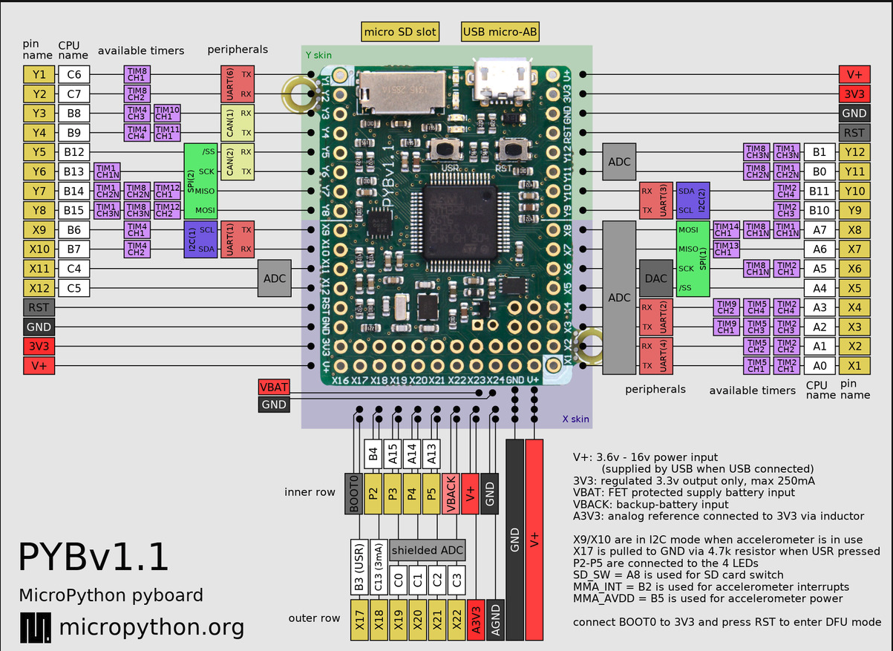
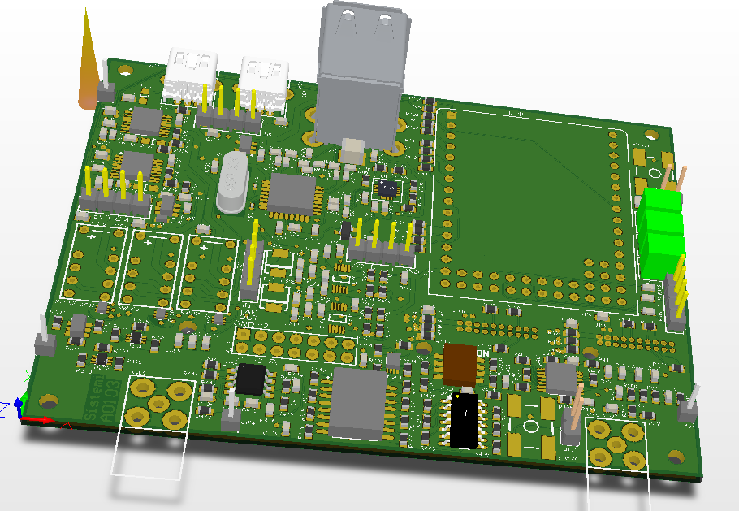
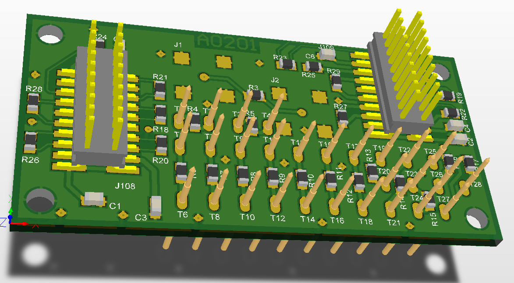
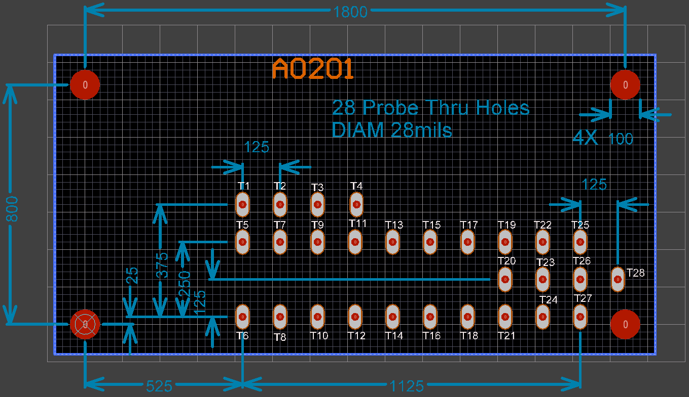

Test Jigs
#########

Test Jigs are used in production to test your product, which is referred to as Device Under Test (DUT).
These are custom designed fixtures that interface your product (DUT) to the Prism programs.

In general, it is your responsibility to develop your own test jigs based on your requirements.
Sistemi (in general) does not build jigs.  That being said, Sistemi has a reference platform that you may
be able to use, perhaps with some modifications.

.. image:: static/Screenshot_jigs_01.png

.. contents::
   :local:

Definitions
===========

Interface Board
---------------

* A Printed Circuit Board (PCB) that has spring probes and some type of controller that
  the Prism can talk to, to take measurements, and otherwise control the stimulus to the DUT.
* Are custom developed depending on the DUT requirements

  * Sistemi has developed a reference design based on MicroPython board, see TBD

Interface Controller
--------------------

* A device with USB connectivity and a processor in which Prism can control and
  otherwise interface to
* Examples that could be used, Arduino, MicroPython, RaspBerry Pi, etc
* An ``Interface Controller`` may be designed into the ``Interface Board`` or
  it can be a daughter card that plugs into an ``Interface Board``

  * Sistemi has developed a reference design based on MicroPython board, see TBD

Bed of Nails
------------

* An arrangement of spring mounted probes that make electrical connection to the DUT
* the DUT has test points, which are large pads that the spring probes will make contact with

Nest
----

* A landing site for the DUT
* designed to make alignment between the Bed of Nails and the DUT test points

Considerations
==============

* Bed of Nails (probes) can wear out over time, you may want to consider a design that
  allows the Bed Of Nails to be replaced.  This ultimately depends on the cost of replacement.

MicroPython Interface Board IBA01
=================================

NOTE: This is a work in progress and incomplete.

This is a reference design that you may or may not be able to use, depending on your DUT testing
requirements.  The intent here is to re-use this design to bootstrap your test jig design.

This design is open sourced on CircuitMaker tool.  This tool allows you to fork the design, make it your own.

There are two boards, one is the MicroPython Interface board, the other is a Probe Board.  Ribbon
cable makes the connection between the two boards.  The probe positions are on a separate board to allow them
to change without affecting the layout of the Interface Board, and to accommodate the test jig design.

The idea is that when you design your PCB, you place test points on the grid pattern of the probe points
without concern for the function (measurement or stimulous) type of the probe point.
**Although you must take care that all the functions you do need can be addressed by the MicroPython Interface board.**

During the test jig development cycle you can use the IBA01 and manually wire connections from the probe
points to the function on the MicroPython board.  The IBA01 design also includes a prototyping area so
that you could also manually assemble extra functions.

Finally once the development is done, you fork this MicroPython Interface design and make the PCB connections.
You may also use the IBA01 design in production if that works for you.

If the test point grid for V1 doesn't meet your needs, or the pin mux capability of the MicroPython board
doesn't have all the features you need, then you will have to design your own interface board.

MicroPython Pin Mux
-------------------

Full information is here https://docs.micropython.org/en/latest/pyboard/quickref.html

3D View
-------

* The MicroPython board is in the upper right corner (a 3D model was not available)
* There are two through hole headers below the MicroPython board that connect signals to the Probe Board

* The two DIP headers connect signals between the two boards

Probe Board Grid Pattern
------------------------

Image gridline is 25mils.

None of these probe points are wired to any function on the MicroPython Interface Board V1.  There are convenient
landing sites on the PCB however to make it easy to attach a wire to every probe point.

Schematic
---------

The complete schematic is available to be forked on CircuitMaker.
The Schematic and PCB layout are in PDF form in ./public/prism/drivers/iba01

Ubuntu Install
--------------

Make sure the Python requirements have been loaded::

    pip3 install -r requirements.txt

Disable modemmanager as it interferes with MicroPython PyBoard::

    sudo apt-get purge modemmanager

Configuring MicroPython Board
-----------------------------

1) How to setup a "fresh" MicroPython Pyboard ver 1.1 for use with Sistemi Prism:

* Change to directory,

::

        cd ~/git/scripts/public/prism/drivers/iba01

* Boot the Pyboard into DFU mode, by shorting the 3V3 pin to the BOOT0 pin and resetting (button) the board.
        See https://github.com/micropython/micropython/wiki/Pyboard-Firmware-Update

* Update the firmware with this command,

::

        $ sudo python3 pydfu.py -m -u pybv11-thread-20190730-v1.11-182-g7c15e50eb.dfu

2) All files names iba01_*.py need to be copied to the MicroPyboard.
   Use rshell.

   example rshell session::

        martin@martin-Lenovo:~/sistemi/git/scripts/public/prism/drivers/micropythonbrd$ rshell
        Connecting to /dev/ttyACM0 (buffer-size 512)...
        Trying to connect to REPL . connected
        Testing if sys.stdin.buffer exists ... Y
        Retrieving root directories ... /flash/
        Setting time ... Jul 23, 2019 22:04:02
        Evaluating board_name ... pyboard
        Retrieving time epoch ... Jan 01, 2000
        Welcome to rshell. Use Control-D (or the exit command) to exit rshell.
        /home/martin/sistemi/git/scripts/public/prism/drivers/micropythonbrd> cp iba01_*.py /flash
        /home/martin/sistemi/git/scripts/public/prism/drivers/micropythonbrd> exit

3) The PyBoard internal filesystem can get corrupted when power is removed.  To avoid this, press
and hold the reset button when removing power.  The IBA01 design does this by design.

