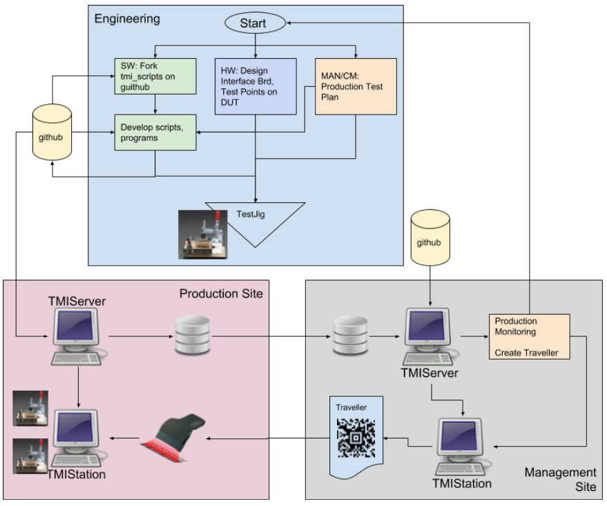
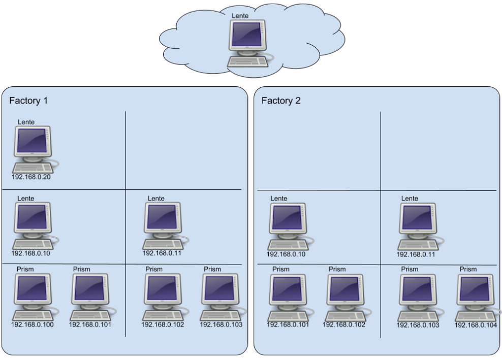

Production Planning
###################

What follows is a general discussion of a production flow, and how Lente/Prism
would be configured.

.. contents::
   :local:

Production Infrastructure Cycle
*******************************

Stages
******

Consider the following simplified production flow diagram,

.. image:: _static/Screenshot_prodplan_01.png

* There are two factories belonging to two different sub-contractors
* The product is represented by ``DUT``
* Factory 1 does two process steps (P1 and P2) to create the first version of the DUT,
  called BOM1 (Bill of Materials)
* The product is then tested, T1
* Then process step P3 is done, creating DUT BOM2, and the product is tested again, T2
* The DUT is shipped to the next factory, and the first thing that is done is a
  repeat of the (outgoing) test T2, this is so that any DUT material damaged in shipping is
  quantified before Factory 2 does any processing.

  * This re-testing is referred to as "incoming" inspection/test
  * This is often required so that damaged or faulty DUT can be quantified before
    more processing is done on the DUT
  * Responsibility for damaged or faulty product needs to be assigned to the right sub-contractor

File Organization
*****************

Naming and organizing the location of files is a difficult thing to prescribe because your needs
may require a specific solution.  Regardless, a general proposal will be given and from there one can
create a more specific solution.

The proposed general purpose solution assumes that version control is an important issue for you.

Consider the following scenario.  A product is in full production and there is a test that is having a 1% failure
rate, but none of the customer returns are associated with failures for this test.  So an ECO is created to change the
limit of the test to reduce the failure rate to an expected 0.5%.  How should you implement this change so that you
can track the new failure rate?  Or search if a product returned would have failed at the previous limit?  These
are the kinds of things you need to think about when you implement test program and script files.

Prism has a high level prescribed directory structure.

Constraints:

* all Prism files must be under ``./public/prism``
* all script files must be under ``./public/prism/scripts``

Naming Conventions
==================

A naming strategy is totally up to you.  No strategy at also is also a choice.

That being said, experience has taught that not having a strategy very quickly leads to confusion and
chaos.  If you end up being successful, upfront planning will really pay off 1-2 years down the road when
try to piece together when you built what, with what version of that, with what ECO, on what version of
BOM, ...

Many small companies try to be cool and come up with nifty names to describe things.  That works short
term but falls apart down the road.  The worst thing that can happen to you is that your successful!

There is a reason why big companies use seemingly random numbers to name things... it works.  But you do
need a "secret decoder ring" to determine what something is when you just have a generic number as a
label.  This is whgat you keep track of in a spreadsheet (which is the secret decoder ring).

Prism needs the names of the following,

* scripts

  * specific to

    * product
    * stage (T1, T2, & T3 in the diagram)
    * version

* program files

  * specific to

    * script
    * stage (T1, T2, & T3 in the diagram)
    * version
    * common (to everything)

* Test Items (these are the test IDs indicated in the scripts and implemented in programs)

  * specific to

    * product
    * stage (T1, T2, & T3 in the diagram)
    * version

This is a lot to wrap your head around, so to avoid future confusion, a proposal for structure is presented.

Naming Proposal
***************

All of these naming conventions, versions, will end up in the results file, in that way, you precisely know
by which scripts, programs, and methods a test was done.

Product naming

* P###mm

  * ### => 000, 001, etc, represents a class of product
  * mm => 00, 01, etc, model or version of the product

* In a spreadsheet (or other tool) keep a list of P### that correspond to internal project names,
  or actual BOM numbers, etc.

Test Script naming

* P###mm_Tssvv_DESCRIPTION.scr

  * ss => 00, 01, etc, represents test stage number
  * vv => 00, 01, etc, version

Test Program naming (product specific)

* P###mm_Tssvv_DESCRIPION.py

  * the test script and test program don't need to have the same name

Test Program naming (common)

* Fnnnvv_DESCRIPTION.py

  * nnn => 000, 001, etc, represents test number
  * vv => 00, 01, etc, version

Test Method naming

* TSTnnnvv_DESCRIPTION

  * nnn => 000, 001, etc, represents test number

Example of files,

::

    ./public/prism/scripts/companyName
    ./public/prism/scripts/companyName/P001
    ./public/prism/scripts/companyName/P001/P00100_T0100_SmokeTests.scr
    ./public/prism/scripts/companyName/P001/P00100_T0100_SmokeTests.py
    ./public/prism/scripts/companyName/P001/P00100_T0200_LoadFinalCode.scr
    ./public/prism/scripts/companyName/P001/P00100_T0200_LoadFinalCode.py
    ./public/prism/scripts/companyName/comm/F00100_ResetSTM32F479.py

Example script P00100_T0100_SmokeTests.scr,

::

    {
      "info": {
        "product": "P001_Shazam",
        "bom": "B00012-001",
        "lot": "1922-1",
        "location": "FACTORY1"
      },
      "config": {
        "result": "public.prism.result.ResultBaseKeysV1",
        "fail_fast": false,
        "drivers": ["public.prism.drivers.fake.fake"]
      },
      "tests": [
        {
          "module": "public.prism.scripts.companyName.comm.F00100_ResetSTM32F479",
          "options": {},
          "items": [
            {"id": "TST0100_setBOOT0",     "enable": true, "args": {"out": "LOW"}},
            {"id": "TST0200_powerVDD",     "enable": true, "args": {"value": "3300"}},
            {"id": "TST0300_delayMS",      "enable": true, "args": {"delay_ms": 1000}},
          ]
        },
        {
          "module": "public.prism.scripts.companyName.P001.P00100_T0100_SmokeTests",
          "options": {},
          "items": [
            {"id": "TST0100_powerUP",  "enable": true },
            {"id": "TST0200_measVDD",  "enable": true, "args": {"min": 3100, "max": 3400},
                                       "fail": [{"fid": "TST02-1", "msg": "Component U1"},
                                                {"fid": "TST02-2", "msg": "Component R1"}]},
            {"id": "TST0300_measVCC",  "enable": true, "args": {"min": 2600, "max": 2800},
                                       "fail": [{"fid": "TST03-1", "msg": "Component U2"}]},
          ]
        }
      ]
    }

Example program F00100_ResetSTM32F479,

::

    ! /usr/bin/env python
    # -*- coding: utf-8 -*-

    import logging
    from core.test_item import TestItem
    from public.prism.api import ResultAPI

    # file name and class name must match
    class F00100_ResetSTM32F479(TestItem):

        def __init__(self, controller, chan, shared_state):
            super().__init__(controller, chan, shared_state)
            self.logger = logging.getLogger("SC.{}.{}".format(__name__, self.chan))

        def TST0100_setBOOT0(self):
            context = self.item_start()  # always first line of test
            ...
            self.item_end() # always last line of test

        def TST0200_powerVDD(self):
            context = self.item_start()  # always first line of test
            ...
            self.item_end() # always last line of test

        def TST0300_delayMS(self):
            context = self.item_start()  # always first line of test
            ...
            self.item_end() # always last line of test

Example program P00100_T0100_SmokeTests,

::

    ! /usr/bin/env python
    # -*- coding: utf-8 -*-

    import logging
    from core.test_item import TestItem
    from public.prism.api import ResultAPI

    # file name and class name must match
    class P00100_T0100_SmokeTests(TestItem):

        def __init__(self, controller, chan, shared_state):
            super().__init__(controller, chan, shared_state)
            self.logger = logging.getLogger("SC.{}.{}".format(__name__, self.chan))

        def TST0100_powerUP(self):
            context = self.item_start()  # always first line of test
            ...
            self.item_end() # always last line of test

        def TST0200_measVDD(self):
            context = self.item_start()  # always first line of test
            ...
            self.item_end() # always last line of test

        def TST0300_measVCC(self):
            context = self.item_start()  # always first line of test
            ...
            self.item_end() # always last line of test

IP Addressing
*************

What follows is a simple design for allocating the IP addresses of Prism and Lente
computers.  You may decide to do this differently.

Assumptions:

* Fixed IP addresses are used
* the LAN IP is 192.168.0.X

Prism IPs
=========

* Label each PC what its IP address is
* Addresses

  * 192.168.0.100  (first Prism)
  * 192.168.0.101
  * 192.168.0.102
  * etc

Lente IPs
=========

* Label each PC what its IP address is
* Addresses

  * 192.168.0.10 (first Lente, at lowest level in hierarchy)
  * 192.168.0.20 (second Lente, at next level in hierarchy)
  * etc

Example
=======

In this example there are two factories,

* no computers are exchanged between the factories
* note Factory 1 has two levels of Lente, and note the IP addressing
* The IP address of Lente in the cloud is unknown, and is typically given to you

Further Work
============

Consider using hostnames for Lente to avoid IP addressing....
