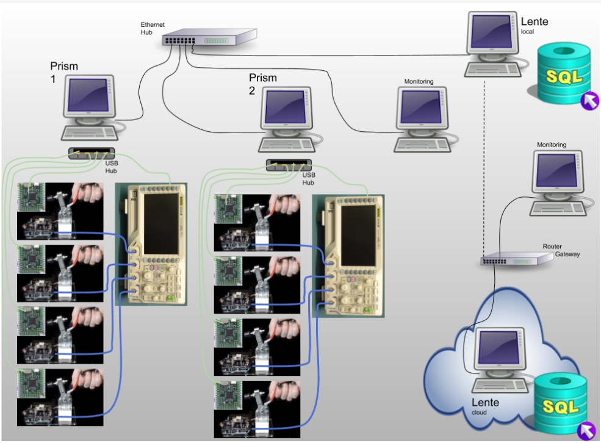
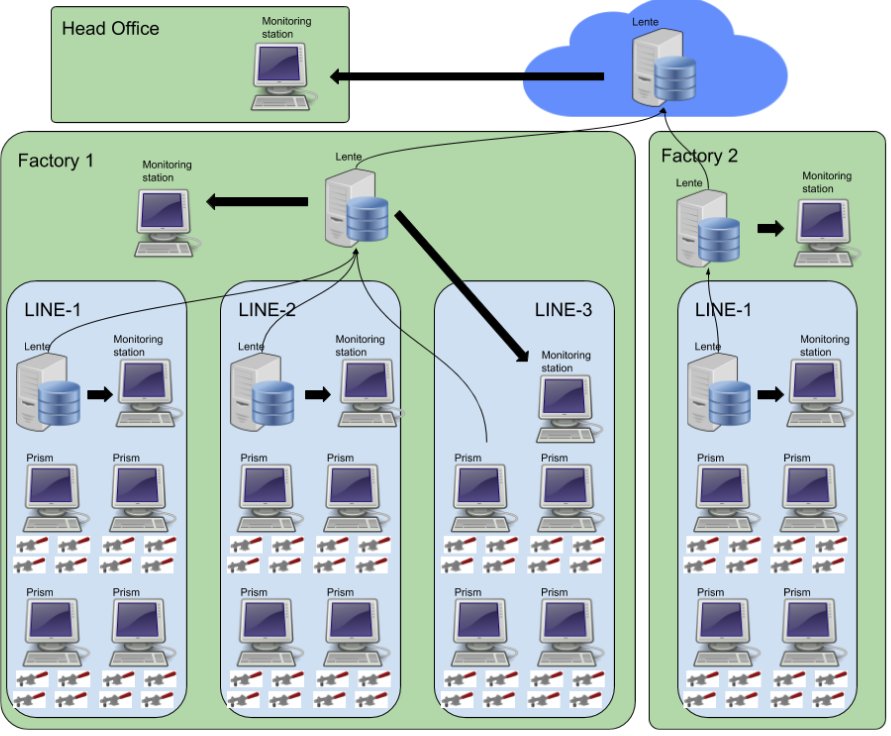

System
######

.. _system_arch:

This section describes system related considerations to building your test system with
Prism and Lente.

.. contents::
   :local:

Architecture
************

This is a typical Sistemi system architecture layout.  More complex systems are possible and
shown later in this section.

Notes:

* Local wired LAN for Prisms and Lente (local)

  * Wired LANs are more reliable and secure than wireless
  * This LAN should NOT have a connection to the internet

* Prisms

  * only two are shown but there can be as many as needed
  * USB is used to connect to local test jigs and test equipment
  * Test equipment can be shared across test jigs at one Prism station

    * Support for sharing equipment across Prisms is not (yet) supported

  * Sends results to Lente

    * if a Lente is not online, testing can still continue, results will
      be staged for upload to Lente when it comes online

* Lente

  * there should only be ONE per LAN
  * this computer should have a fixed IP address as every Prism is configured
    to look for Lente
  * Lente can be configured to send its results upstream to another Lente
  * Lente can be run in the cloud

    * Local Lente can be configured to send their results upstream to a cloud
      based Lente, thus all you results can end up in one place
    * As noted above, you don't want to have your production LAN connected to the
      internet for security and reliablity reasons, therefore, at some regular
      interval you will remove a local Lente from the production LAN and connect it
      to the internet so it can find the upstream Lente and upload results to it

This is a more sophisticated Sistemi system plan.

Here two remote factories send their data to a cloud Lente so that Head Office can
monitor all Result data.

Note in Factory 1 there are three production lines.  Line 1 and 2 have their own local
Lente and a monitoring station for viewing the dashboard.  Line 3 does not have a
local Lente and is using the factory Lente.

Results Flow
************

This diagram also shows a possible architecture of a Sistemi system.  In this diagram the focus
is on what happens to DUT results.

This architecture shows how Lente can be stacked
on top of each other.  Each Lente is aggregating more results that come from below it.  In
this case, two factories are supplying results to a central Lente.

.. image:: static/Screenshot_system_network_02.png

What follows is a description of lables A-F...

* A

  * Result JSON is created at Prism station and saved locally to a `stage` directory
* B

  * At some point, Prism will attempt to contact Lente and send the result
    JSON to it.
  * If Lente is not connected/reachable, the file remains in `stage`.
* C

  * If Lente indicates the file was received successfully, Prism result is moved from
    `stage` to the `bkup` folder.
* D

  * Lente processes the result JSON into its (postgres) database.
* Derr

  * If there was a processing error, the result JSON is stored in `quarantine` folder.
* E

  * result JSON is stored in `bkup` folder if it was processed without error.
* F

  * if this Lente is configured to have an upstream Lente, the result JSON is stored
    in `stage` folder

* At this point, the process B-F repeats itself.

Notes:

#. The Result JSON is backed up at each level.  These backups can be turned off if desired.
#. Any Lente dashboard can be accessed with web browser.  The results that can be seen
   will be that which is local to that Lente.

Docker
******

Prism and Lente are running as Docker images/containers.  Using Docker containers has two
advantages,

* Less impact of the local operating system setup, and/or installed libraries, modules, etc.
  on impacting Prism/Lente
* Deployment (software updates) via Docker Hub

Docker is a large subject and there is a lot of online content.  There are but a few Docker
commands that you should know for the purposes of troubleshooting.

Check what is running
---------------------

To determine what docker images are running,

::

        $ docker ps
        CONTAINER ID   IMAGE               COMMAND                CREATED      STATUS      PORTS                                       NAMES
        c206788fcc35   sistemicorp/prism   "python ./prism.pyc"   5 days ago   Up 5 days   0.0.0.0:6590->6590/tcp, :::6590->6590/tcp   prism

* Key information

  * STATUS: how long has the image been running.  If there has been a reset/crash, the running time will be less than
    what you expect.

.. _system-helper-docker:

Helper Docker Scripts
---------------------

Prism and Lente each have a helper script for simplifying working with Docker.

The scripts can be found here:

::

    ~/git/scripts/public$ ll
    total 36
    drwxr-xr-x  4 martin martin 4096 Jun  7 17:21 ./
    drwxrwxr-x 10 martin martin 4096 Jun  7 16:13 ../
    -rwxr-xr-x  1 martin martin 2954 Apr 29 13:11 lente.sh*        <---- Lente helper
    drwxr-xr-x  5 martin martin 4096 Jun  7 16:09 prism/
    -rwxr-xr-x  1 martin martin 4409 Apr 29 13:11 prism.sh*        <---- Prism helper
    -rw-r--r--  1 martin martin 1619 Jun  7 17:21 settings.json
    -rw-r--r--  1 martin martin  121 Jun  7 16:56 VERSION

Each script will display a help if run with no arguments,

::

        ~/git/scripts/public$ ./prism.sh
        Usage: prism.sh [flags] <command>

        command:
          start                     Start Prism

            flags, --server=, -s    (REQUIRED) Lente IP address. Use 'none' if no Lente.
                   --hostname=, -h  Specify an alternative hostname for this computer (default martin-staric2)
                   --restart=, -r   <always|no> (default no) 'always' will start Lente EVERY time the
                                    computer is booted, which is typically used on a node that
                                    is in actual deployment.
                                    To disable restart, use 'docker update --restart=no prism'
                                    and then reboot the node.

          update                    Update the docker image, requires internet connection.
                                    You will need to restart Prism with the start command.

          stop                      Stop Prism

How to use these scripts in detail is covered in :ref:`_deployment:Deployment` section.

