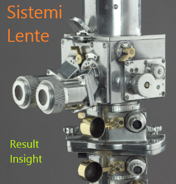

Welcome to Sistemi's Lente/Prism documentation!
===============================================

The Prism/Lente platform is a manufacturing test system that provides a framework for creating
test programs to test your product.

The platform is intended to allow you to focus on testing your product, rather than the
infrastructure to manage the data, scripts, users, roles, version control, reporting and other mundane stuff.

Prism is the production floor test runner.

Lente is the backend manager and dB.

EMAIL: info@sistemi.ca for more information.

.. toctree::
   :maxdepth: 2
   :caption: Contents:

   prism_main
   lente_main
   _system
   _prodplan
   _database
   _development
   _jigs
   _security
   _deployment
   _mes_integration
