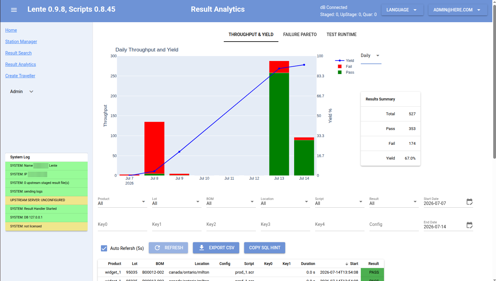
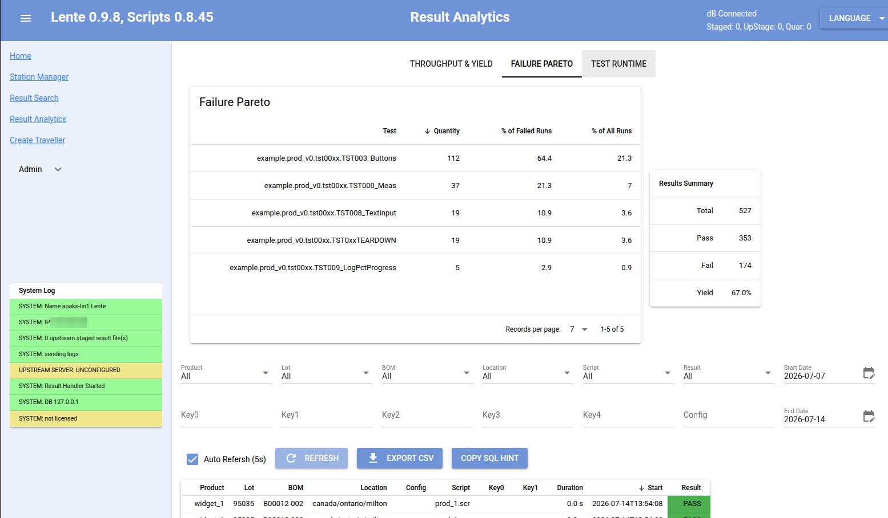
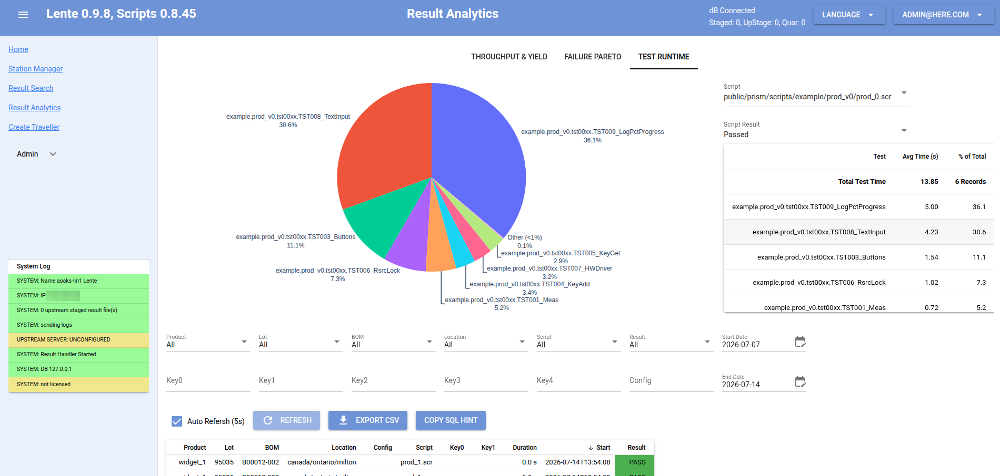
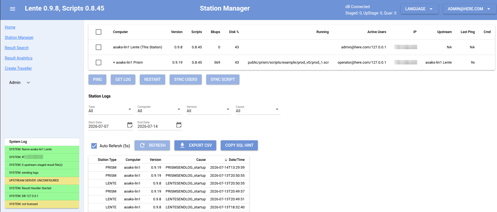
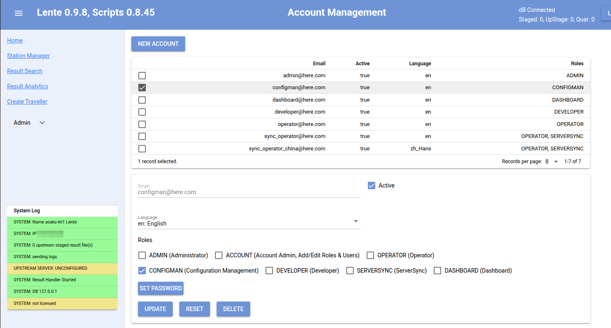

Screenshots
###########

Lente screenshots.

Result Analytics
****************

The Result Analytics dashboard is for detailed results analysis.  Results shown graphically and in
the table are filtered by the current state of the "Select/Date" filters.

The dashboard has three views, selected by the tabs across the top,

* `Throughput & Yield` - history of Pass/Fail/Yield numbers
* `Failure Pareto` - which tests are failing, ranked by how often
* `Test Runtime` - where the test time is being spent

The `Results Summary` panel on the right totals the Pass/Fail/Yield for the current filter selection.

The table below the filters is each result.  By selecting a result in this table, a new tab is opened with the
result details.

The `Throughput & Yield` tab charts the units tested over time; Pass and Fail as stacked bars against the left
axis, and Yield as a line against the right axis.  The period selector sets the size of each bar, for
example `Daily`.  Use this to track production output and yield trend.

The `Failure Pareto` tab ranks the failing tests by quantity, and shows each as a percentage of the failed runs
and of all runs.  Use this to find which tests are costing you the most yield.

The `Test Runtime` tab breaks down where the test time is being spent.  Select the `Script` and the `Script Result`
to report on.  The table gives the average time of each test item and its percentage of the total, and the pie
chart shows the same proportions.  Use this to find which test items to optimize to reduce cycle time.

Station Manager
***************

Prism and Lente Station management console.

* View station stats - version, scripts, backups, disk usage, the script running, active users, and last ping
* Select stations and take actions - `Ping`, `Get Log`, `Restart`, `Sync Users`, `Sync Script`
* `Station Logs` below lists station events, filtered by the Type/Computer/Version/Cause and date selections

Account Management
******************

A single page manages all of the Account Management features.

The table at the top summarizes the Users; their email, whether they are Active, their Language, and their Roles.

* `New Account` creates a User
* Selecting a User in the table loads them into the editor below

The editor sets the User's Language, whether the account is `Active`, and which Roles they hold.  `Set Password`
sets the User's password.  `Update` saves the changes, `Reset` discards them, and `Delete` removes the User.

