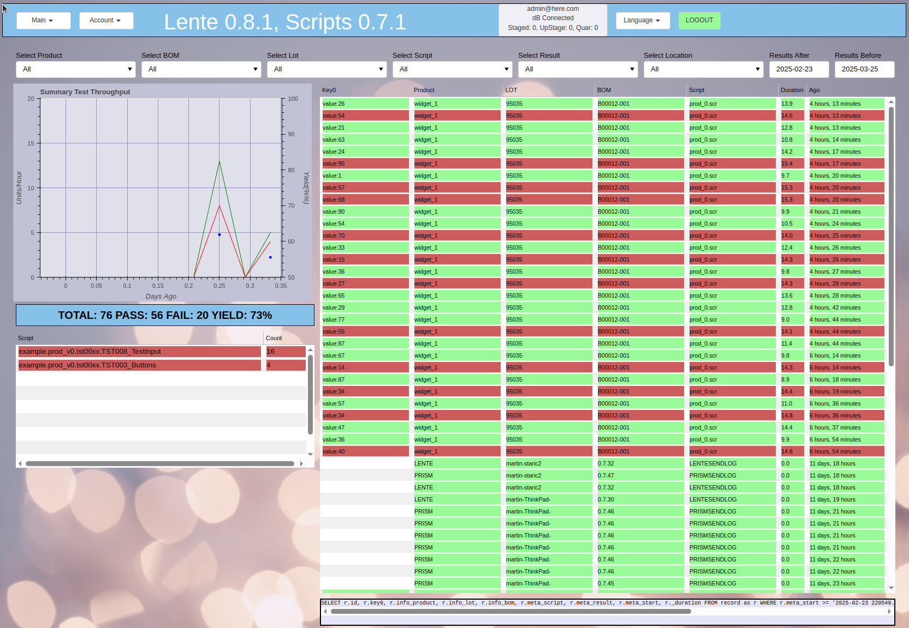

Screenshots
###########

Lente screenshots.

Dashboard
*********
The dashboard shows an overall realtime view into the production results.

A row of pulldown selectors allow you to filter the view of data to a particular subset. All
widgets are updated with data only from these filter settings.

A date range is also available.

The upper right corner shows current yield status.

The left (green) table provides a list of all passing results, and the right (red) table all the failing results.

The lower row graphs show test durations, test pass/fail rates per hour.  The bottom right red table
is a summarized table of the top failure items.

