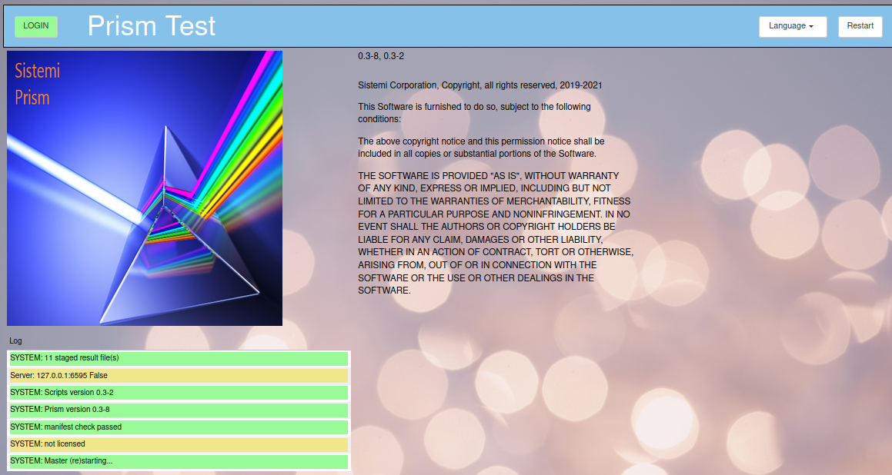
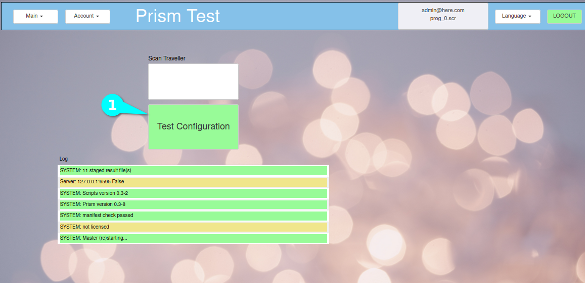
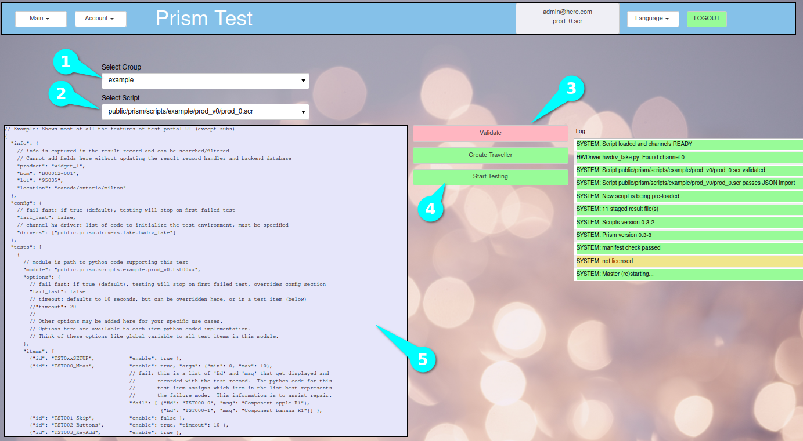
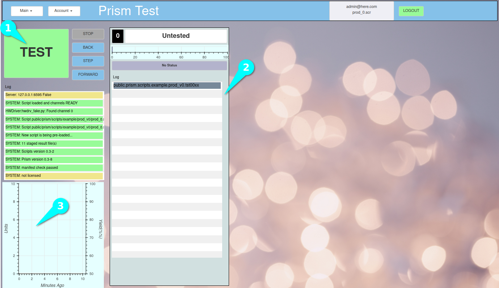

Prism Demo
##########

.. _prism-full-install:

Sistemi Lente/Prism programs are deployed as Docker containers, which allows the programs to run in a virtual
environment, and be independent of your host operating system.  This means, for example, that you don't have
to worry about python packages, versions of modules, etc..

This is the program that production operators would use, interfaces with test equipment and the Device Under Test (DUT)

.. contents::
   :local:

Requirements
************

* Operating System

  * The system was developed and tested on Ubuntu 22.04
  * All these instructions are for Ubuntu 22.04
  * The Docker Prism image is based on Ubuntu 22.04

* Outside Software Requirements

  * Google Chrome browser (other browsers are not tested)
  * install Docker CE (https://docs.docker.com/install/linux/docker-ce/ubuntu/)

    * Several instillation methods are described.  The "convenience script" works well.

::

    curl -fsSL https://get.docker.com -o get-docker.sh
    sudo sh get-docker.sh

* Don't miss the step of adding the current user (its well hidden in their instructions)

::

        sudo usermod -aG docker ${USER}

* reboot Ubuntu

* install additional packages

::

    sudo apt update
    sudo apt install git build-essential python3-dev

Clone Sistemi Scripts
=====================

* There is a prescriptive directory structure to use, and that is stored on `github` in a project called ``scripts``
* This `github` repo is where you would ultimately store and version control your own scripts

  * To make the repo your own, instead of cloning the repo, you would *fork* (copy) it,
    making it your own, and then add your own code

* The instructions below will create a folder called *git/scripts* which `git` will copy the required files into

* Clone ``scripts`` and install Python requirements,

::

    mkdir ~/git
    cd ~/git
    git clone https://github.com/sistemicorp/scripts.git
    cd scripts
    pip3 install -f requirements.txt

* The **Prism** Docker container must be `pulled` from docker hub

  * run this pull command to check for updates to **Prism**

::

    docker pull sistemicorp/prism

* Run Prism

::

    cd ~/git/scripts/public
    ./prism.sh --server=none --restart=no start

* Open Google Chrome to

    http://127.0.0.1:6590

  * **Do Not use the browser BACK button, always use the page controls for navigation**
  * The Prism landing page should appear,

* Press the Login button (upper left corner)

  * Prism login user/password is admin@here.com/password
  * Other users passwords are `password`

* Its a good idea to bookmark this URL, and display bookmark bar in the browser.
* This is the Main page, the starting point to begin testing.

  * In real production environment, the operator would scan a traveller to
    configure Prism to test a product.  Since this is a demo, we will select a
    test manually.
  * Select button `Test Configuration` (1)

* Run your first script after logging in,

  * Select Group select `Example` (1)
  * Select Script select `prod_0.scr` (2)
  * Press button `Validate` (3)
  * If everything checked out, the `Start Testing` button will turn Green. (4)
  * The script that will be run is shown (5)

* Press `Start Testing` (4) to proceed to the testing view.

* Press the `TEST` (1) button to begin the test.
* Logging from the test will be shown in the table (2).
* Historical stats of your testing will be shown in the plot (3).
* **Note:** Example tests have delays in them for demo effect.
* `prod_0.scr` test script, demonstrates many features

  * the user will be shown buttons to press, any button will pass.
  * the user will have to enter some text, any text will pass

* this Demo shows only one active "Jig", if you want to display more,

  * Access the Main menu and select Demo (Main->Demo)
  * Change the number of "fake" jigs between 1-4.
  * Go back to the Main page (Menu->Main)
  * Repeat the steps above to re-run the demo test.

* Prism can be stopped with this command,

::

./prism.sh stop
