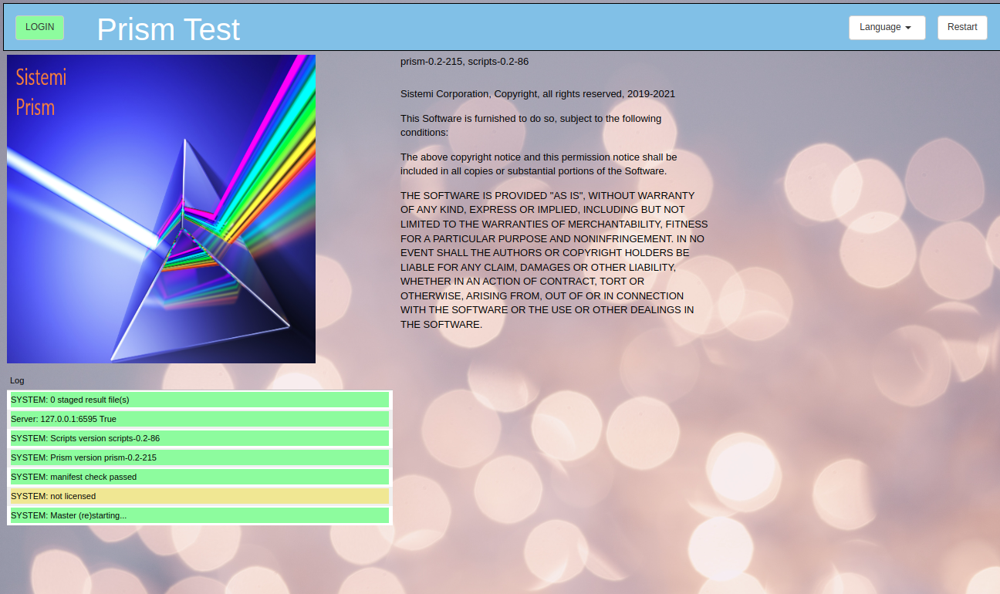
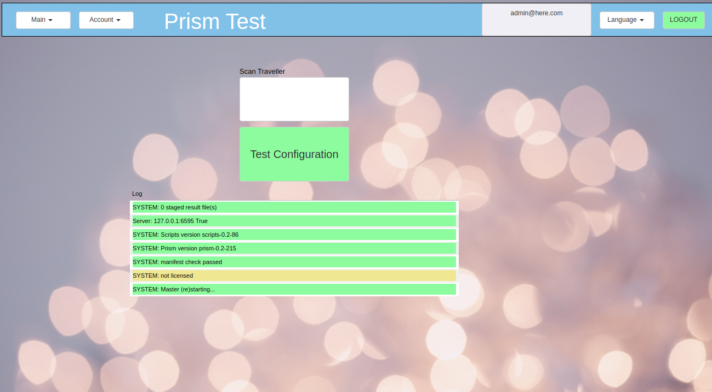
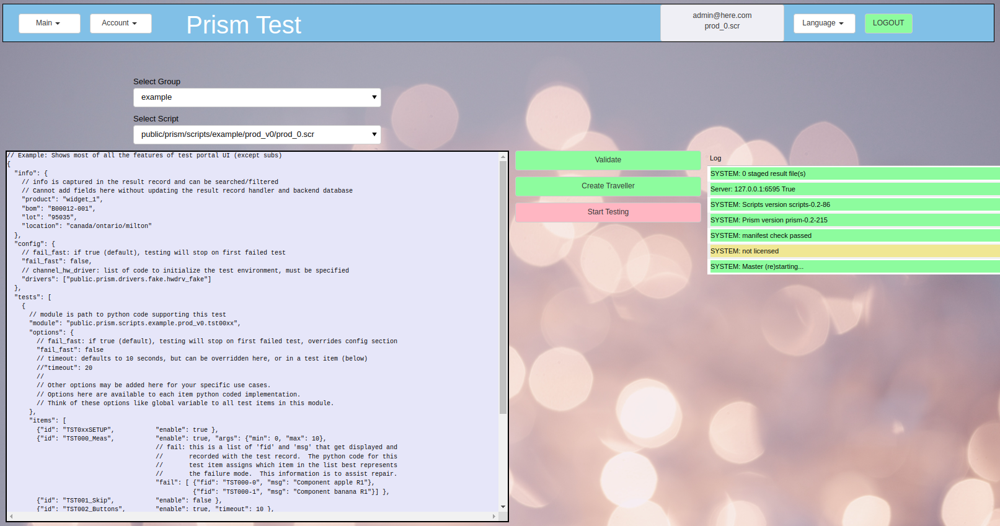
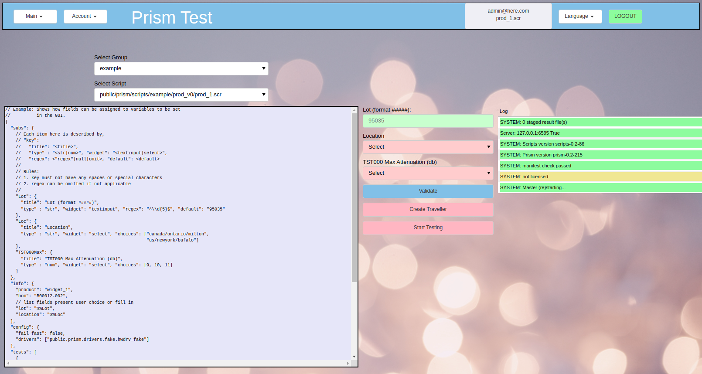

Screenshots
###########

Title Page
**********

Main view
*********
After the User has logged in, they may scan a traveller to configure Prism testing, or
use the Test Configuration button to access scripts manually.

Test Config view
****************

Simple (No Variables) Script
============================

* A pull down dialog box allows the user to pick which script to run
* The script is shown on the left.  The script cannot be modified with this `Prism` view
* The script is a JSON format text file, with the exception that lines begining with `#` are comment lines
* This script example has no user configurable variables

Variables Script
================

* This script is an example of a script with user configurable variables
* On the right side, there are (red) fields which need to be filled in
* The fields are validated by pattern checking

  * fields can be text input
  * fields can be pull down selections

Test View
*********

* The result after 4 channels of the demo script have finished
* For each channel a log table is shown

.. image:: static/Screenshot_test_01.png

