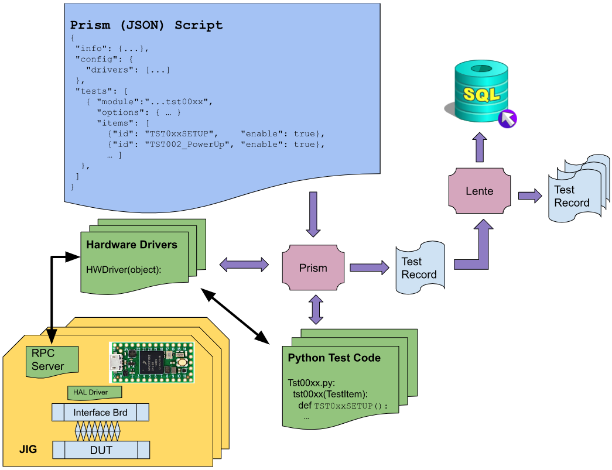

Software Architecture
#####################

Referring to the above diagram:

Script
------

The script is a JSON(like) text file that defines the tests and information for
a particular Device Under Test (DUT).

The script file is essentially human readable, with the intention that some changes
to the test sequence can be made without changing the underlying programming
(which is usually a more involved process).  For example, if there is a maximum limit for
a particular test that is unknown, or subject to change, that limit can be defined
in the script and changed at will; no Python code needs to change.

Hardware Drivers
----------------

HW Drivers are a Python class that is created/copied from a template with the following purposes,

* Discovers the hardware connected to the Prism PC

  * There may be one or more of the hardware devices connected
  * Often USB physical cabling is used to discover multiple hardware types
  * The Interface board is a "hardware driver" object (class)
  * There may be one hardware that is shared among multiple Interface Boards.

* Creates an object instantiation of the hardware which is passed along to the Python
  test script.

The Hardware driver(s) associated with a particular test setup are listed in the Script (above).

The Hardware driver code is run only once, on Script validation.

The Hardware Driver provides an API class and communication pathway for Python Test Code
to request stimulus or measurements.  For example, Teensy4 devices will appear as
serial ports to the Prism PC. The Hardware Driver will create a Teensy4 class object that
will include a serial port interface, as well as an abstracted API for all the functions
that the Teensy4 supports, like reading an ADC to measure a voltage.

The Hardware Driver is meant to make the actual Python Test code as straightforward
as possible.

Python Test Code
----------------

Python Test code performs the tests on the DUT.  Here is where you will find the actual
code that sets up the DUT stimulus and performs the measurements on the DUT to determine
Pass/Fail results.

The Python Test code is a class.  For every test Jig connected to the Prism PC, there will
be an instantiation of the Python Test code, and each jig can run in parallel to all the others.

The methods in the Python test code map to tests that are defined in the Script (above).  Each
method will have access to the arguments from the Script (if any).

The Python Test code class gets a handle to the Hardware Driver(s) that were "discovered".
The handles are mapped per slot, thus the same code can handle multiple attached test jigs.

Python Test code, via the Hardware Driver's API, set up the stimulus and/or make measurement(s)
per the test (item) as defined in the Script (above).  For every measurement taken, Prism
will create a Test Record.

The measurement will typically determine if the Test will Pass or Fail.

JIG - RPC Server
----------------

Consider the example of Teensy4, there is a JSON RPC Server running on the Teensy.
The Hardware Driver will discover and create a Class for the Teensy.  The Example
code provided in the scripts git repo includes the discovery and class API code.

The example discovery class code should not have to change for most applications.

Consider the Teensy4's module LED control code in the example.  Reviewing the code
that implements that API explains the architecture.  Note there is a Teensy4 command
line interface (CLI) Python program that is intended to test the Teensy's Class APIs.

JIG - HAL Driver
----------------

For a particular implementation of an Interface Board for a DUT, specific hardware stimulus
and/or measurement functions will be designed.

Teensy would interface to those functions via one of its (local) communications ports, for example,
I2C or SPI.

Controlling and accessing those functions via the Teensy's local communications ports
would become an extended API from the basic functions included in the example code.

