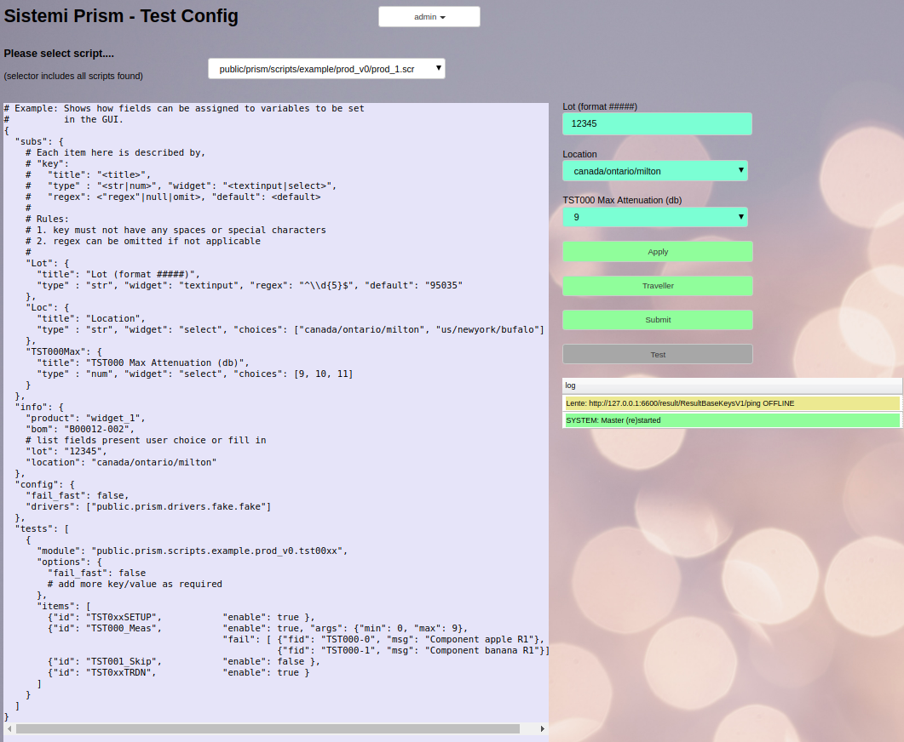
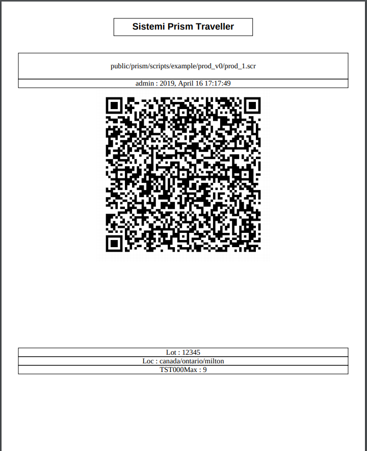
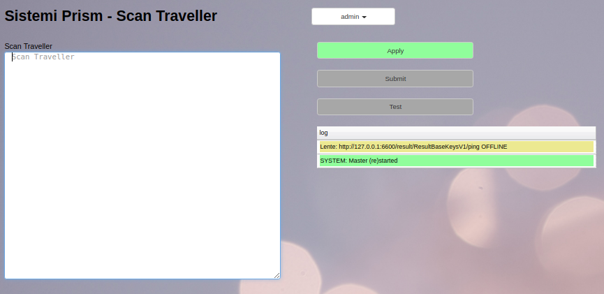

Travellers
##########

Travellers are 2D bar codes printed on paper than can configure Prism
to run a script with certain substitution parameters.  Travellers are used to simplify
setting up and operating Prism by any User (operator).

Travellers can only be created by users with the :ref:`prism_accounts:ConfigMan` role.

The image below shows the `Test Config` view, a script has been selected and
the parameters selected, at this point the `Traveller` button turns Green
indicating it can now be pressed.

Pressing the `Create Traveller` button will create the Traveller and save it as a PDF.

The traveller shows the User that created it, the time and date, and the parameters
used when it was created.

This is a PDF document which is saved to the Download folder of your PC.  The intent is the
PDF file is delivered to production as an additional traveller to the product.  When the product
reaches the Prism test station, the traveller is scanned and testing can begin.

Scanning
********

Travellers are scanned by the operator using most any bar code scanner set
to emulate the keyboard.  After the Operator logs in the Prism waits for a scan,

Once the image is scanned the system will validate and then move to the Test Portal
where testing can start.

Note that Operator sign in Roles can be changed such that the Operator cannot access the
Test Configuration or other menu options.

User Content
************

Adding a `traveller` section to the script you may add your own content.
For example see `public/prism/scripts/example/prod_v0/prod_0.scr`,

::

    {
      "info": { ... },
      "config": { ... },
      "tests": [ ... ],
      "traveller": {
        // text to appear in a cell on the Traveller PDF
        // must be one line (per cell), use \n for newlines
        "Instructions": "1. On Your Mark.\n2. Get Set.\n3. Go!",
        "Inspections": "QA: ______________          COUNT IN: ___________ PASS: ___________ FAIL: ____________\nMFG:____________"
      }
    }

Auto Load Traveller
*******************

The `settings.json <_deployment.html#_Settings File>`__ can specify a traveller that is automatically loaded when
Prism boots up and the indicated user logs in.

::

  // On startup optionally specify to load a traveller
  //"load_traveller": "public/traveller/traveller_TZ6T.pdf",
  //"load_user": "operator@here.com",

This feature can be used to create a User account that runs a Traveller.

