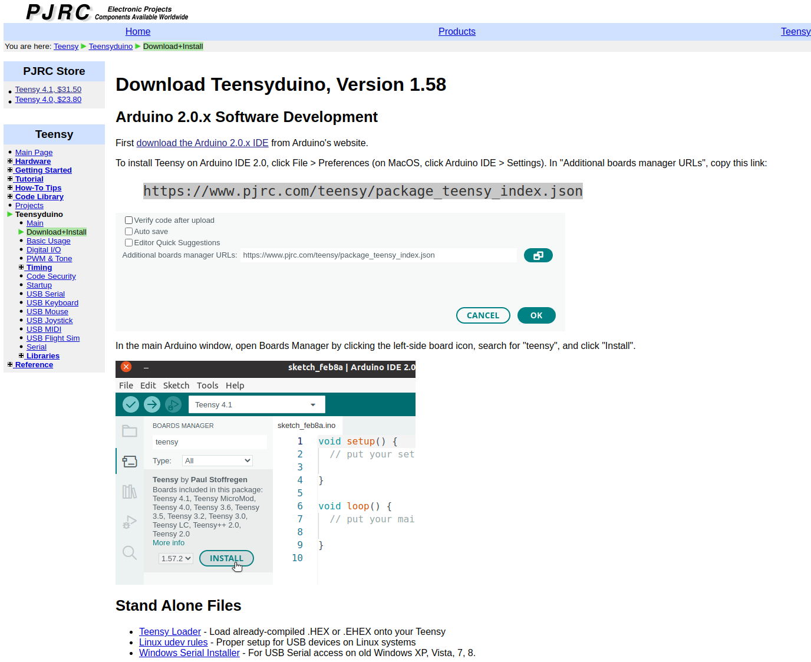
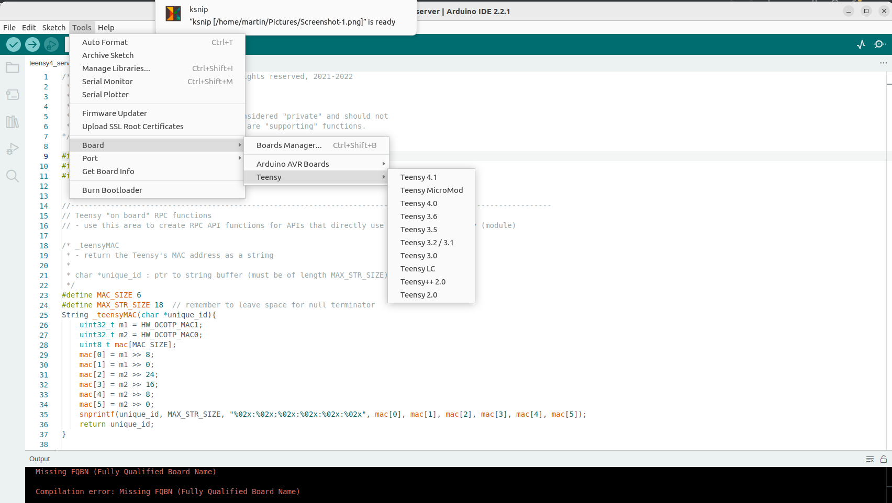
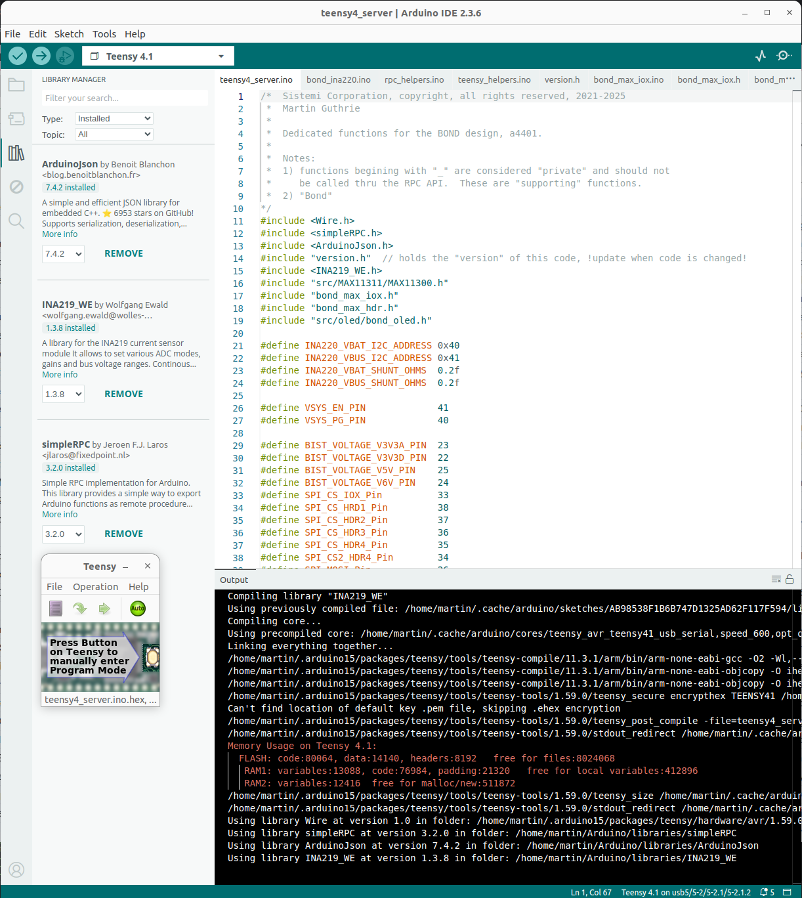

Instructions for Teensy 4.x development:

These instructions are for developers who need to modify BOND behaviour, or to add additional
functionality.  You should not need to modify Teensy code if you are just using BOND.  The 
Teensy code found in the Prism BOND example is sufficient to use BOND.

Things to read before starting:

      https://www.pjrc.com/store/teensy41.html
      https://www.pjrc.com/store/teensy41.html#programming

1) Follow setup instructions here, https://www.pjrc.com/teensy/td_download.html

   

   At this time the Arduino IDE version 2.3.6 was used, following instructions for loading the
   AppImage, found here https://docs.arduino.cc/software/ide-v2/tutorials/getting-started/ide-v2-downloading-and-installing/
   Note that you have to install libfuse2 for Ubuntu 22/24 mentioned in the link instructions.

   Note: Ubuntu doesn't seem to play nice with the AppImage, so recommend using the zip file.
   But there must be a better way to do this.  Note the Unbuntu App Store only had version 1.8.

        ~$ cd /opt
        /opt$ sudo unzip ~/Downloads/arduino-ide_2.3.6_Linux_64bit.zip
        /opt$ sudo ln -s arduino-ide_2.3.6_Linux_64bit/arduino-ide arduino-ide
        /opt$ cd ~ 
        ~$ sudo chmod 4755 /opt/arduino-ide_2.3.6_Linux_64bit/chrome-sandbox

   TODO: How to get a desktop icon for the Arduino IDE?

   Download and install the Linux UDEV rules: https://www.pjrc.com/teensy/00-teensy.rules

   The teensy CLI loader is used by Prism scripts to load teensy, and that binary
   is stored in `scripts` repo. libusb-dev is required to use it.

        sudo apt-get install libusb-dev
   
   Adding user to the dailout group (need to re-login for this to take effect):

      sudo usermod -a -G dialout $USER

   Optional CLI loader source and information:

      * https://www.pjrc.com/teensy/loader_cli.html
      * https://github.com/PaulStoffregen/teensy_loader_cli

   Test the Teensy CLI:

    ~/git/scripts/public/prism/drivers/A4401_BOND/server$ ./teensy_loader_cli --version
    Unknown option "--version"
    
    Usage: teensy_loader_cli --mcu=<MCU> [-w] [-h] [-n] [-b] [-v] <file.hex>
        -w : Wait for device to appear
        -r : Use hard reboot if device not online
        -s : Use soft reboot if device not online (Teensy 3.x & 4.x)
        -n : No reboot after programming
        -b : Boot only, do not program
        -v : Verbose output
    
    Use `teensy_loader_cli --list-mcus` to list supported MCUs.
    
    For more information, please visit:
    http://www.pjrc.com/teensy/loader_cli.html

2) Start the Arduino IDE
   - Select the board, Tools->Board->TeensyArduino->Teensy41

3) Install library dependencies: Go to the top ribbon menu and select 'Sketch'.
   - In the drop down menu select 'Include Library' then 'Manage Libraries' to open the Library Manager.
   - In the Library Manager put simpleRPC (ver 3.2.0) in the search bar. Install the library.
   - In the Library Manager put ArduinoJson (ver 7.4.2) in the search bar. Install the library.
   - In the Library Manager put INA219_WE (ver 1.3.8) in the search bar. Install the library.

4) Open teensy4_server.ino with the Arduino IDE.  This is where you will find `setup()` and `loop()`.

5) Generating a Hex file from Arduino
    - In Arduino IDE, File->Preferences, turn on Show Verbose Output During: Compilation
    - Compile the sketch by pressing the Arduino IDE Verify (check mark) icon (top-left)
    - Note the panel output for the location of the compiled file, you will need this in later steps,

    /home/martin/.cache/arduino/sketches/AB98538F1B6B747D1325AD62F117F594/teensy4_server.ino.elf

6) Connect the BOND to power and Teensy to USB.

7) Go to Arduino IDE and upload the sketch onto the Teensy by pressing the `Upload` icon in the upper left.
A Teensy pop-up window will appear showing the status of the Teensy as it uploads.  You do not need to press
the button, things should happen automatically.

8) OPTIONAL: Program Teensy with command line tool,

    martin@martin-staric2:~/git/scripts/public/prism/drivers/teensy4/server$ ./teensy_loader_cli --mcu=TEENSY41 -w -v ../../../../prism/scripts/example/teensy4_v0/assets/teensy4_server.ino.hex 
    Teensy Loader, Command Line, Version 2.2
    Read "../../../../prism/scripts/example/teensy4_v0/assets/teensy4_server.ino.hex": 70656 bytes, 0.9% usage
    Found HalfKay Bootloader
    Programming..................................................................
    Booting

NOTE: The Teensy CLI loader is used to update BOND's Teensy from a Prism script.  The Teensy
ELF is copied to an assets folder and used by the CLI.

9) Build code in the Arduino IDE, and upload to Teensy.

   - The Arduino IDE will automatically compile the code and upload it to the Teensy.
   - For Prism to upload Teensy copy the Teensy4 ELF/Hex files created to the assets folder of your BOND scripts.

      (venv) martin@martin-ThinkPad-L13:~/git/scripts/public/prism/drivers/A4401_BOND$ cp /home/martin/.cache/arduino/sketches/AB98538F1B6B747D1325AD62F117F594/teensy4_server.ino.elf ~/git/scripts/public/prism/scripts/example/BOND_v0/assets/
      (venv) martin@martin-ThinkPad-L13:~/git/scripts/public/prism/drivers/A4401_BOND$ cp /home/martin/.cache/arduino/sketches/AB98538F1B6B747D1325AD62F117F594/teensy4_server.ino.hex ~/git/scripts/public/prism/scripts/example/BOND_v0/assets/

   - WARNING: If you are using both Arduino and Prism BOND Update script, make sure to copy these files to the
     assets folder of the BOND script you are using.  Else you could be over writing Arduino new code with stale
     assets files.

   - DEBUG: Showing Teensy devices with lsusb,

    martin@martin-virtual-machine:~/git/scripts/public/prism/drivers/teensy4/server$ lsusb
    Bus 001 Device 050: ID 16c0:0486 Van Ooijen Technische Informatica Teensyduino RawHID
    Bus 001 Device 001: ID 1d6b:0002 Linux Foundation 2.0 root hub
    Bus 002 Device 004: ID 0e0f:0008 VMware, Inc. Virtual Bluetooth Adapter
    Bus 002 Device 003: ID 0e0f:0002 VMware, Inc. Virtual USB Hub
    Bus 002 Device 002: ID 0e0f:0003 VMware, Inc. Virtual Mouse
    Bus 002 Device 001: ID 1d6b:0001 Linux Foundation 1.1 root hub

After programming, the teensy will show up as a serial, like so,

    martin@martin-virtual-machine:~/git/scripts/public/prism/drivers/teensy4/server$ lsusb
    Bus 001 Device 053: ID 16c0:0483 Van Ooijen Technische Informatica Teensyduino Serial

10) Testing BOND at the command line (CLI)

   - See the readme one folder up.

11) Programming a FRESH Teensy on BOND via Prism Developer CLI (Note this does not always work)

   - if you have been using the Arduino IDE as above and downloading code to the BOND, the Teensy4 is no longer
     FRESH, it has existing code on it, and these steps do not apply.
   - However, when a new BOND board is built and a Teensy is populated on it, that Teensy is FRESH and doesn't
     have any code running on it, except the bootloader that comes on Teensy by default.
   - ONLY ONE BOND can be attached via USB at a time for this to work.
   - You may skip this step for now, but its something you may need to come back to for actual production environments.
     Or, for production you may decide that new BOND boards will be programmed via the IDE, rather than through Prism.
   - close the Arduino IDE and power cycle the BOND board, unplug/replug Teensy from USB
   - To put the Teensy into a FRESH state manually, 
     - press and hold the button on the Teensy for ~15 seconds, wait till LED turns bright RED
     - Remove USB cable to remove power from Teensy, then plug USB back in
     - No LEDs should be on now
     - Press the Button once on Teensy, the LED will turn dim RED
     - It can be hard to get Teensy into this state.  Use the Arduino IDE to program a fresh Teensy.
   - run the script, and result (note inside venv),

    (venv) martin@martin-ThinkPad-L13:~/git/scripts$ python prism_dev.py --script public/prism/scripts/example/BOND_v0/bond_progfresh_0.scr 
       12                   prism_dev.py: 396 -                           root:                main() INFO  : args: {'script': 'public/prism/scripts/example/BOND_v0/bond_progfresh_0.scr', 'result_scan': False}
       12                   prism_dev.py: 388 -                           root:    script_validated() INFO  : Script passed validation tests
       12             resultBaseClass.py:  52 -              ResultBaseClass.0:            __init__() INFO  : DONE
       12            ResultBaseKeysV1.py:  67 -             ResultBaseKeysV1.0:            __init__() INFO  : DONE
       13                   prism_dev.py: 150 -                      ChanCon.0:                 run() INFO  : HWDRV: public.prism.drivers.A4401_BOND.hwdrv_A4401_BOND_prog
       81       hwdrv_A4401_BOND_prog.py:  46 -       hwdrv_A4401_BOND_prog.py:            __init__() INFO  : Start
       81                     sys_log.py:  14 -                        sys_log:          pub_notice() INFO  : HWDriver:hwdrv_A4401_BOND_prog.py: Found 1!
       81       hwdrv_A4401_BOND_prog.py:  91 -       hwdrv_A4401_BOND_prog.py:   discover_channels() INFO  : Done: 1 channels
       82                   prism_dev.py: 185 -                      ChanCon.0:                 run() INFO  : hwdrv_A4401_BOND_prog - number channels 1
       82                   prism_dev.py: 199 -                      ChanCon.0:                 run() INFO  : number channels 1
       82                   prism_dev.py: 210 -                      ChanCon.0:                 run() INFO  : Module: public.prism.scripts.example.BOND_v0.bond_P00xx, fail_fast: True
       88                   test_item.py:  22 -                  SC.TestItem.0:            __init__() INFO  : DONE
       88                   prism_dev.py: 219 -                      ChanCon.0:                 run() INFO  : ITEM: {'id': 'P0xxSETUP', 'enable': True}
       88                   test_item.py:  29 -                  teensy400xx.0:          log_bullet() WARNI : bullet text max length exceeded, truncating
       88                   prism_dev.py: 142 -                      ChanCon.0:          log_bullet() INFO  : BULLET: teensy4: {'channel': 0, 'type': 'TEENSY4_PROG', 'o
       88                  bond_P00xx.py:  58 -                  teensy400xx.0:           P0xxSETUP() INFO  : teensy4: {'channel': 0, 'type': 'TEENSY4_PROG', 'obj': {'id': 0, 'version': '0.0', 'unique_id': '0.0'}} <built-in function id>, chan 0
       88                   prism_dev.py: 219 -                      ChanCon.0:                 run() INFO  : ITEM: {'id': 'P100_Check', 'enable': True}
      376                  bond_P00xx.py:  79 -                  teensy400xx.0:          P100_Check() INFO  : Bus 006 Device 001: ID 1d6b:0003 Linux Foundation 3.0 root hub
    Bus 005 Device 005: ID 05e3:0610 Genesys Logic, Inc. Hub
    Bus 005 Device 003: ID 0489:e0cd Foxconn / Hon Hai Wireless_Device
    Bus 005 Device 013: ID 1c4f:0002 SiGma Micro Keyboard TRACER Gamma Ivory
    Bus 005 Device 006: ID 046d:c077 Logitech, Inc. M105 Optical Mouse
    Bus 005 Device 039: ID 16c0:0478 Van Ooijen Technische Informatica Teensy Halfkay Bootloader
    Bus 005 Device 004: ID 0bda:5411 Realtek Semiconductor Corp. RTS5411 Hub
    Bus 005 Device 002: ID 0bda:5411 Realtek Semiconductor Corp. RTS5411 Hub
    Bus 005 Device 001: ID 1d6b:0002 Linux Foundation 2.0 root hub
    Bus 004 Device 001: ID 1d6b:0003 Linux Foundation 3.0 root hub
    Bus 003 Device 002: ID 06cb:00bd Synaptics, Inc. Prometheus MIS Touch Fingerprint Reader
    Bus 003 Device 001: ID 1d6b:0002 Linux Foundation 2.0 root hub
    Bus 002 Device 001: ID 1d6b:0003 Linux Foundation 3.0 root hub
    Bus 001 Device 002: ID 04f2:b6d9 Chicony Electronics Co., Ltd Integrated Camera
    Bus 001 Device 001: ID 1d6b:0002 Linux Foundation 2.0 root hub
    
      376                   prism_dev.py: 142 -                      ChanCon.0:          log_bullet() INFO  : BULLET: Teensys on USB: 1
      376                   prism_dev.py: 219 -                      ChanCon.0:                 run() INFO  : ITEM: {'id': 'P200_Program', 'enable': True, 'file': 'teensy4_server.ino.hex'}
      376                   prism_dev.py: 142 -                      ChanCon.0:          log_bullet() INFO  : BULLET: teensy4_server.ino.hex
      376                   prism_dev.py: 142 -                      ChanCon.0:          log_bullet() INFO  : BULLET: Press Teensy Button
     1495                  bond_P00xx.py: 118 -                  teensy400xx.0:        P200_Program() INFO  : Teensy Loader, Command Line, Version 2.2
    Read "./public/prism/scripts/example/teensy4_v0/assets/teensy4_server.ino.hex": 70656 bytes, 0.9% usage
    Found HalfKay Bootloader
    Programming..................................................................
    Booting
    
     1495                   prism_dev.py: 219 -                      ChanCon.0:                 run() INFO  : ITEM: {'id': 'P300_Verify', 'enable': True, 'delay': 5}
     1495                   prism_dev.py: 142 -                      ChanCon.0:          log_bullet() INFO  : BULLET: 5s wait for boot
     6501                   prism_dev.py: 142 -                      ChanCon.0:          log_bullet() INFO  : BULLET: done wait
     6505                  bond_P00xx.py: 158 -                  teensy400xx.0:         P300_Verify() INFO  : Serial Ports to look for Teensy ['/dev/ttyACM0']
     6505                  bond_P00xx.py: 166 -                  teensy400xx.0:         P300_Verify() INFO  : Trying teensy at /dev/ttyACM0...
     6505                     Teensy4.py:  79 -                     teensy.try:            __init__() INFO  : version 0.1.0
     6506                     Teensy4.py:  88 -                     teensy.try:                init() INFO  : attempting to install Teensy on port /dev/ttyACM0
     8512                     Teensy4.py: 246 -                     teensy.try:             version() INFO  : version
     8512                     Teensy4.py: 191 -                     teensy.try:       _rpc_validate() INFO  : {'success': True, 'method': 'version', 'result': {'version': '0.1.0'}}
     8514                     Teensy4.py: 177 -                     teensy.try:    _jig_close_check() INFO  : Jig Closed Detector not defined (None)
     8515                     Teensy4.py: 114 -                     teensy.try:                init() INFO  : Installed Teensy on port /dev/ttyACM0
     8515                   prism_dev.py: 142 -                      ChanCon.0:          log_bullet() INFO  : BULLET: Found teensy
     8515                     Teensy4.py: 222 -                     teensy.try:           unique_id() INFO  : unique_id
     8515                     Teensy4.py: 191 -                     teensy.try:       _rpc_validate() INFO  : {'success': True, 'method': 'unique_id', 'result': {'unique_id': '04:e9:e5:15:5f:99'}}
     8515            ResultBaseKeysV1.py: 272 -             ResultBaseKeysV1.0:         measurement() INFO  : teensy4_id: 04:e9:e5:15:5f:99 STR :: PASS
     8515            ResultBaseKeysV1.py: 296 -             ResultBaseKeysV1.0:         measurement() INFO  : {'name': 'P300_Verify.teensy4_id', 'unit': 'STR', 'min': None, 'max': None, 'value': '04:e9:e5:15:5f:99', 'result': 'PASS'}
     8515                   prism_dev.py: 142 -                      ChanCon.0:          log_bullet() INFO  : BULLET: teensy4_id: 04:e9:e5:15:5f:99 STR :: PASS
     8515                     Teensy4.py: 246 -                     teensy.try:             version() INFO  : version
     8516                     Teensy4.py: 191 -                     teensy.try:       _rpc_validate() INFO  : {'success': True, 'method': 'version', 'result': {'version': '0.1.0'}}
     8516            ResultBaseKeysV1.py: 272 -             ResultBaseKeysV1.0:         measurement() INFO  : teensy4_version: 0.1.0 STR :: PASS
     8516            ResultBaseKeysV1.py: 296 -             ResultBaseKeysV1.0:         measurement() INFO  : {'name': 'P300_Verify.teensy4_version', 'unit': 'STR', 'min': None, 'max': None, 'value': '0.1.0', 'result': 'PASS'}
     8516                   prism_dev.py: 142 -                      ChanCon.0:          log_bullet() INFO  : BULLET: teensy4_version: 0.1.0 STR :: PASS
     8516                     Teensy4.py: 125 -                     teensy.try:               close() INFO  : closing /dev/ttyACM0
     8518             resultBaseClass.py: 186 -             ResultBaseKeysV1.0:      record_publish() INFO  : Result: PASS, Created: result_f06516f9-75e7-4f61-a9d9-bff73112aa08.json

12) Updating BOND Teensy via Prism

   - If BOND's Teensy is running the server code, it can be updated via Prism.  The server code has some functions to
     to put Teensy into a mode where new code can be uploaded to it.  This updating path is different then the above
     path which only the Teensy's built in bootloader is available.
   - See the example BOND script for the update code.

13) MAX11311 Setup

   - The MAX11311 pots can be configured for DAC, ADC, GPO, GPI and that is done by 
     `public/prism/drivers/A4401_BOND/A4401_BOND.py:A4401_BOND:_init_maxs()`
     - And on the Teensy side by code at `public/prism/drivers/A4401_BOND/server/teensy4_server/bond_max_hdr.ino:bond_max_hdr_init()` 
   - An example of the json-like file that is used to define the MAX11311 ports is found at
     `public/prism/drivers/A4401_BOND/pogo_hdr_definition._json`
     - BOND is intended to support multiple DUT targets in production and the MAX11311 port assignment is
       part of that flexibility.  A Prism script can call out a specific port assignment file to be used by 
       a certain DUT, using a specific Pogo board.
   - Setting the MAX11311 ports is detailed process, defined in the datasheet, but there is also a PC side tool that
     one can use which generates C code.

14) Battery Emulator Calibration

   - See the schematic for the battery emulator.  The Battery Emulator can source and sink current.
   - header #1 uses dedicated MAX11311 port 9 as a DAC to operate the Battery Emulator.
   - The output of the Battery emulator is monitored by the INA220 (U9), which can measure the Battery Emulator
     output voltage and current.

15) Normal Workflow

   - The Arduino IDE is open and connected to the Bond Teensy
   - Make code changes and use the IDE to push code to the target
   - In a terminal window run the BOND Python CLI to test out commands
     - You don't need to use the CLI push new code to Bond Teensy
   - When done testing code, you need to remember to copy the hex/elf files to the Prism folder(s)
     - As shown in step 11 above 

16) version.h

   - this version file is provided so that Prism can determine if a BOND system is running the right version of code.
   - updating this file is manual task 

