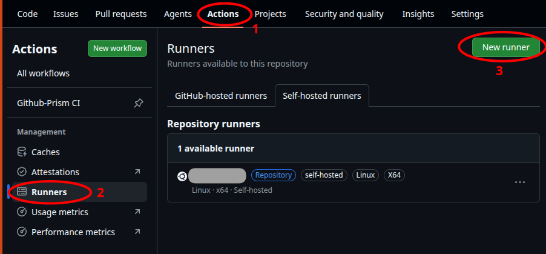
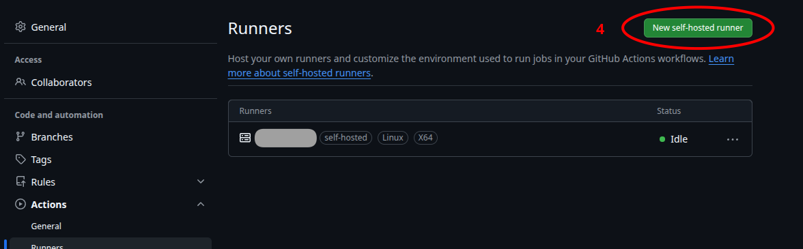
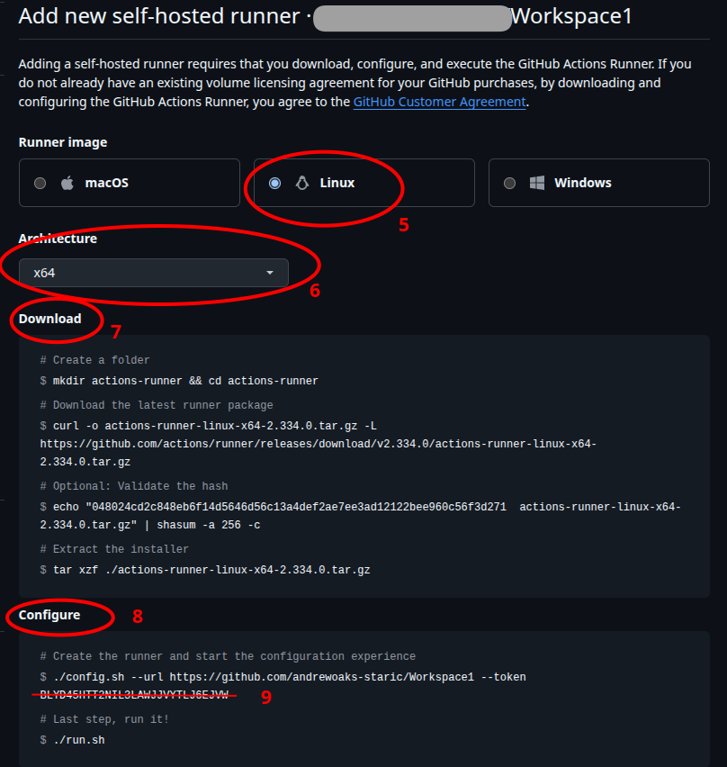
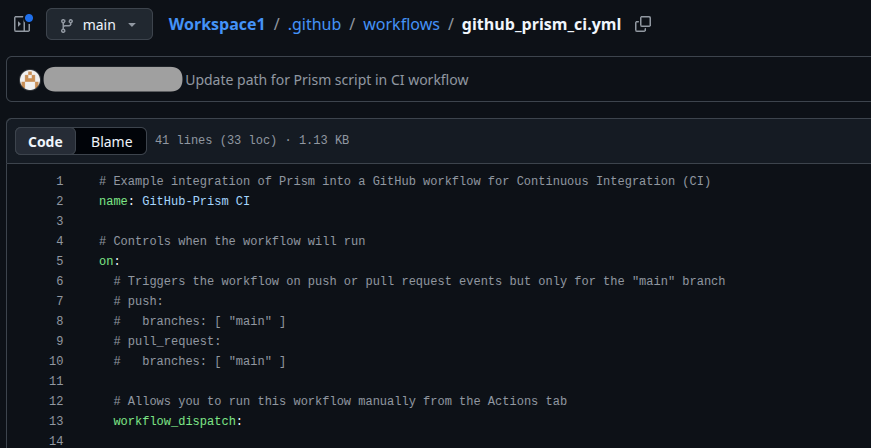

# Example PrismPlay driver to enable GitHub CI integration

## Overview
* Proof of concept of integrating Prism into a GitHub CI process
* Steps (Where hosted)
  * GitHub Workflow Script (GitHub) --> Self-hosted Action-Runner (Host OS) --> prism_play_cli.py (Host OS) --> Named Pipe (Shared Filesystem) --> PrismPlay Prism Driver (Prism Docker) --> Prism Script (Prism Docker)
* Utilizes PrismPlay Prism driver
  * see [README.md](README.md)
* Additional files for proof of concept:
  * [github_prism_ci.yml](github_prism_ci.yml)
  * [public/prism/scripts/example/prod_v0/githubci_0.scr](../../scripts/example/prod_v0/githubci_0.scr)
  * [public/prism/scripts/example/prod_v0/tstGitHubCIxx.py](../../scripts/example/prod_v0/tstGitHubCIxx.py)

## Setup GitHub Self-Hosted Action-Runner
(See GitHub documentation [add-runners](https://docs.github.com/en/actions/how-tos/manage-runners/self-hosted-runners/add-runners)
for more details.  Note warning regarding public repositories)
* The Action-Runner executes on the system that is hosting the Prism Docker
* From your GitHub repo that generates the artifact to be use in testing
  * Click 'Actions' (1), then 'Runners' (2), then 'New runner' (3)

  * Click 'New self-hosted runner' (4)

  * Select 'Linux' (5) and 'x64' (6) and follow instructions 'Download' (7) and 'Configure' (8)
    * On the system hosting the Prism docker, start in 'scripts/public' directory (ie first step
    should create scripts/public/actions-runner)
    * 'token' (9) is specific to this attempt to install a self-hosted actions-runner and is only
    valid for about 1/2 hour.
      * Refresh page or click 'New self-hosted runner' again to generate a new token.

* Action-Runner must be started for GitHub-Prism CI integration to work
  * To manually start, see last instruction of 'Configure' above
  * Action-runner can be installed as a service to automatically start when the machine starts
    * [Configuring the self-hosted runner application as a service](https://docs.github.com/en/actions/how-tos/manage-runners/self-hosted-runners/configure-the-application)

## GitHub Workflow Setup
* The workflow is part of repository that generates the artifact being testing
  * Workflow files reside in the repository directory '.github/workflows'
  * Create directory in repository if required
* Example workflow file is provided in this repo/directory: github_prism_ci.yml
  * Copy to above directory and update as required

