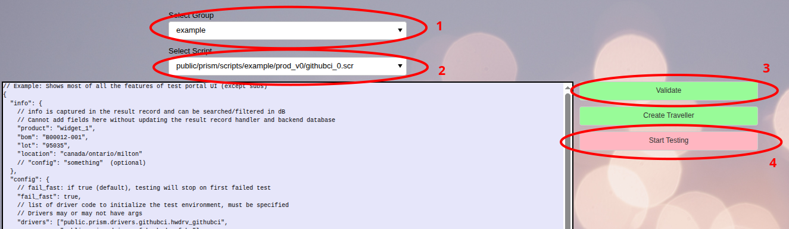
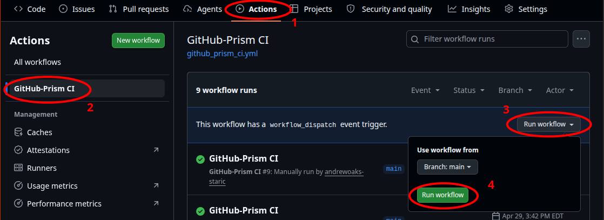
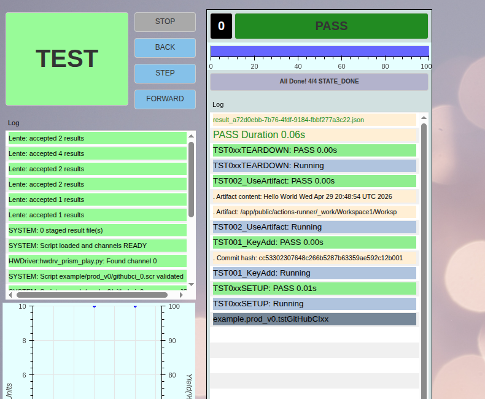
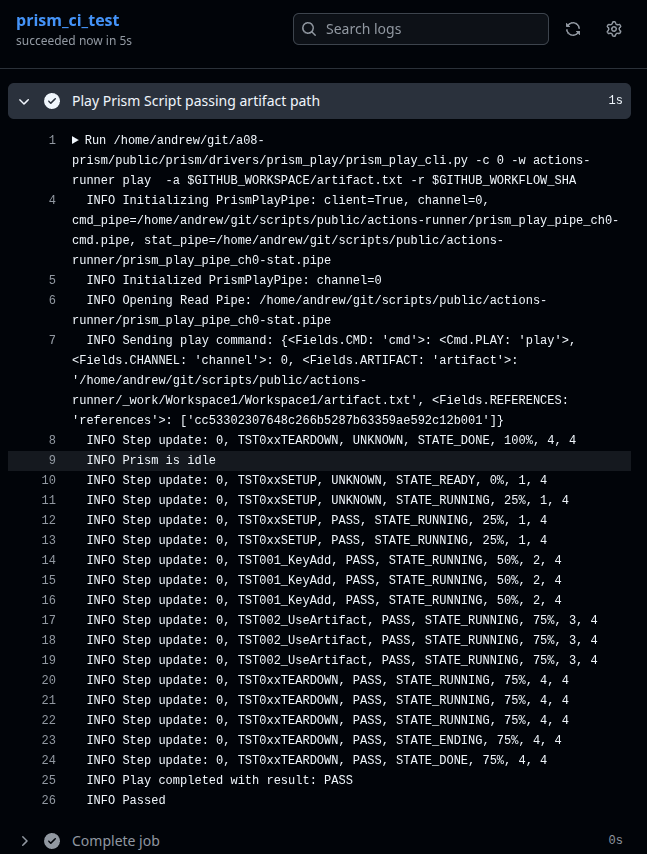
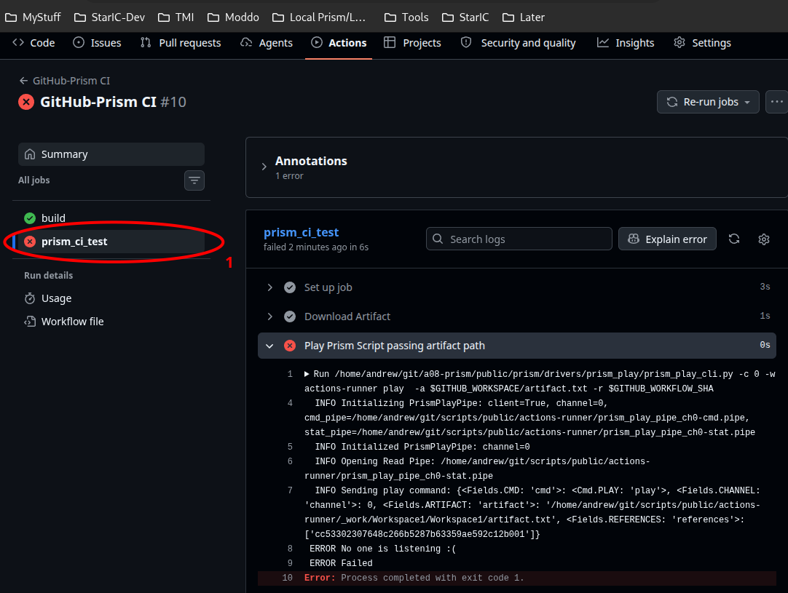
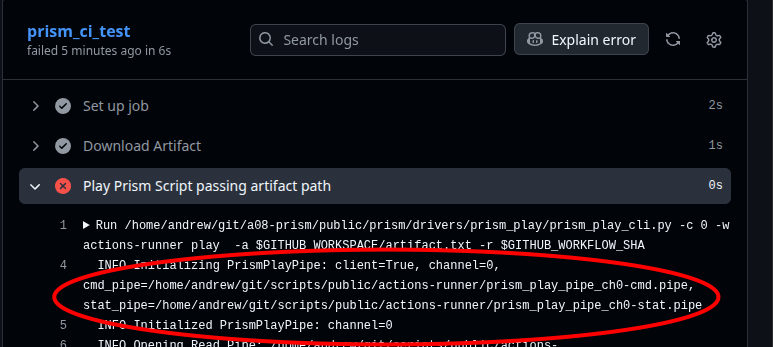
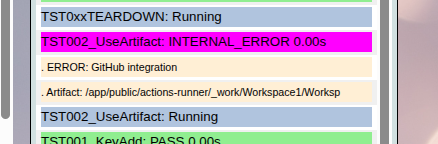

# Example PrismPlay driver to enable GitHub CI integration

## Overview
* Proof of concept of integrating Prism into a GitHub CI process
* Steps (Where hosted)
  * GitHub Workflow Script (GitHub) --> Self-hosted Action-Runner (Host OS) --> prism_play_cli.py (Host OS) --> Named Pipe (Shared Filesystem) --> PrismPlay Prism Driver (Prism Docker) --> Prism Script (Prism Docker)
* Utilizes PrismPlay Prism driver
  * see [README.md](README.md)
* Additional files for proof of concept:
  * [github_prism_ci.yml](github_prism_ci.yml)
  * [public/prism/scripts/example/prod_v0/githubci_0.scr](../../scripts/example/prod_v0/githubci_0.scr)
  * [public/prism/scripts/example/prod_v0/tstGitHubCIxx.py](../../scripts/example/prod_v0/tstGitHubCIxx.py)

## Setup GitHub Self-Hosted Action-Runner
(See GitHub documentation [add-runners](https://docs.github.com/en/actions/how-tos/manage-runners/self-hosted-runners/add-runners)
for more details.  Note warning regarding public repositories)
* The Action-Runner executes on the system that is hosting the Prism Docker
* From your GitHub repo that generates the artifact to be use in testing
  * Click 'Actions' (1), then 'Runners' (2), then 'New runner' (3)


  * Click 'New self-hosted runner' (4)


  * Select 'Linux' (5) and 'x64' (6) and follow instructions 'Download' (7) and 'Configure' (8)
    * On the system hosting the Prism docker, start in 'scripts/public' directory (ie first step
    should create scripts/public/actions-runner)
    * 'token' (9) is specific to this attempt to install a self-hosted actions-runner and is only
    valid for about 1/2 hour.
      * Refresh page or click 'New self-hosted runner' again to generate a new token.


* Action-Runner must be started for GitHub-Prism CI integration to work
  * To manually start, see last instruction of 'Configure' above
  * Action-runner can be installed as a service to automatically start when the machine starts
    * [Configuring the self-hosted runner application as a service](https://docs.github.com/en/actions/how-tos/manage-runners/self-hosted-runners/configure-the-application)

## GitHub Workflow Setup
* The workflow is part of repository that generates the artifact being testing
  * Workflow files reside in the repository directory '.github/workflows'
  * Create directory in repository if required
* Example workflow file is provided in this repo/directory: github_prism_ci.yml
  * Copy to above directory and update as required


## Run Example Test
* Start GitHub Self-Hosted Action-Runner (see above)
* Start Prism script 'example' --> 'public/prism/scripts/example/prod_v0/githubci_0.scr':



* In GitHub repo with workflow, locate the workflow and run:



* Prism script should trigger to play:



* Github workflow job output should show result:



## Debug Example Test
* Check GitHub Workflow job output
  * Watch for 'No one is listening' error message indicating the prism_play driver is not running
  or listening to the incorrect named pipe location



* Check that the GitHub Self-Hosted Action-Runner received action
```
scripts/public/actions-runner$ ./run.sh

√ Connected to GitHub

Current runner version: '2.334.0'
2026-04-30 14:05:10Z: Listening for Jobs
2026-04-30 14:05:40Z: Running job: prism_ci_test
<...>
```

* Check Prism logs for 'jig_closed_detect' 'Received play' message
```
scripts/public$ egrep "jig_closed_detect.*Received" log/prism.log
2026-04-30 14:22:11,312:  hwdrv_prism_play.py:             prism_play.py:             jig_closed_detect  100 - INFO  : Received play command: {'cmd': 'play', 'channel': 0, 'artifact': '/home/andrew/git/scripts/public/actions-runner/_work/Workspace1/Workspace1/artifact.txt', 'references': ['cc53302307648c266b5287b63359ae592c12b001']}
```

* Check that prism_play_ci.py and PrismPlay driver are using corresponding name pipe locations
  * The filesystem appears at a different locations on the Host OS and Prism Docker
  * Check that the public/\<work-dir\> are the same
  * prism_play_ci.py check Github workflow job output:



  * PrismPlay driver check Prism log files:
```
scripts/public$ grep "Initializing PrismPlayPipe" log/prism.log
2026-04-30 14:26:10,286:  hwdrv_prism_play.py:        prism_play_pipe.py:                      __init__   56 - INFO  : Initializing PrismPlayPipe: client=False, channel=0, cmd_pipe=/app/public/actions-runner/prism_play_pipe_ch0-cmd.pipe, stat_pipe=/app/public/actions-runner/prism_play_pipe_ch0-stat.pipe
```

* Check Prism Test Portal output for error messages and corresponding log messages



```
scripts/public$ less log/prism.log
<...>
2026-04-30 14:26:46,440:         SC.ChanCon.0:                channel.py:                    log_bullet  935 - INFO  : Artifact: /app/public/actions-runner/_work/Workspace1/Worksp
2026-04-30 14:26:46,440:               Master:                 master.py:            onCHANNEL_VIEW_LOG  233 - INFO  : ch_root.view_log - ch: 0, log: .    Artifact: /app/public/actions-runner/_work/Workspace1/Worksp
2026-04-30 14:26:46,441:            tst00xx.0:          tstGitHubCIxx.py:            TST002_UseArtifact  114 - ERROR : Error reading artifact /app/public/actions-runner/_work/Workspace1/Workspace1/artifact.txtbad: [Errno 2] No such file or directory: '/app/public/actions-runner/_work/Workspace1/Workspace1/artifact.txtbad'
2026-04-30 14:26:46,441:         SC.ChanCon.0:                channel.py:                    log_bullet  935 - INFO  : ERROR: GitHub integration
2026-04-30 14:26:46,441:               Master:                 master.py:            onCHANNEL_VIEW_LOG  233 - INFO  : ch_root.view_log - ch: 0, log: .    ERROR: GitHub integration
```

